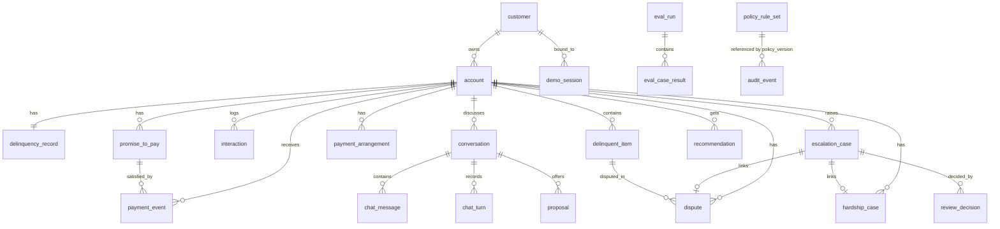

# CollectAI Data Models

Status: design. Companion to `api-contracts.md` (source of truth for field names) and `data-models.schema.json` (JSON Schema draft-07, generated from the same definitions as the tables below, and used to validate the example records in this file and seed data). Synthetic data only: every name, email (`example.com`), phone (`+1-555-01xx`) and identifier below is fictional.

## 1. Conventions

- **Store:** PostgreSQL 16. Schema managed by versioned Alembic migrations (E1-S3); migrations apply cleanly to an empty database and re-run without error.
- **Naming:** tables are singular snake_case (`promise_to_pay`). Column names equal the API field names in `api-contracts.md` (snake_case), so a repository row maps to a Pydantic model without renaming. Each entity's primary key column is `<entity>_id` (`case_id` for `escalation_case`), matching the API.
- **Ids:** opaque prefixed strings `cus_`, `acc_`, `itm_`, `int_`, `ptp_`, `pay_`, `arr_`, `hsp_`, `dsp_`, `esc_`, `dec_`, `conv_`, `msg_`, `trn_`, `prp_`, `rec_`, `aud_`, `evr_` (API contract) plus the internal-only `evc_` (eval case result). Format `^<prefix>_[A-Za-z0-9]{6,40}$`. Generated ids are time-sortable ULIDs so new rows cluster in the B-tree; **seed ids are deterministic** (`acc_000123`) so reseeding never orphans audit events. Stored as `text` with a `CHECK (col ~ '^prefix_')` (no native type, keeps prefixes debuggable).
- **Money:** `NUMERIC(14,2)`; Python `Decimal` end to end; JSON strings with exactly 2 dp. There is no float column anywhere. Ratios are `NUMERIC(9,4)`, cost estimates `NUMERIC(12,6)`.
- **Time:** `timestamptz` (UTC). Every timestamp written by the application comes from the injected `Clock`, never from `now()` in SQL. Dates are `date`, interpreted in UTC.
- **Enums:** stored as `text` with a `CHECK (col IN (...))` generated from the Python enum in `types/enums.py`, which mirrors section 5 of `api-contracts.md`. (Text plus CHECK, not native ENUM, because adding a value is then a one-line migration and does not lock.)
- **Ownership (E1-S3 AC6, D-032):** every customer-owned row (`account`, `delinquency_record`, `delinquent_item`, `interaction`, `conversation`, `chat_message`, `chat_turn`, `proposal`, `recommendation`, `promise_to_pay`, `payment_event`, `payment_arrangement`, `hardship_case`, `dispute`, `escalation_case`) carries `customer_id` (FK `customer`). Customer-facing repositories expose only methods that take the session-bound `customer_id` as a mandatory argument and always add `WHERE customer_id = :bound`; a row that is not the customer's is indistinguishable from a missing row.
- **Optimistic concurrency:** mutable aggregates carry `version` (`record_version` on `delinquency_record`). Writers use `UPDATE ... SET version = version + 1 WHERE id = :id AND version = :expected`; zero rows updated is a 409 `VERSION_CONFLICT`.
- **Derived values are not stored:** `remaining_amount`, `simulated_label`, `disputed` (item), treatment suppression (from open cases, hardship, disputes and the customer vulnerability flag), priority score/band/factors (computed on read by the rules engine against the active PolicyRuleSet), age and aging warnings (Clock minus `created_at`).
- **Database roles:** `collectai_owner` runs migrations and owns objects. `collectai_app` is the application role: INSERT, SELECT, UPDATE on business tables as needed, INSERT and SELECT only on `audit_event`, `review_decision`, `payment_event`, `chat_message`. `collectai_readonly` is for reporting and evaluation reads. Audit immutability is enforced by grants, backed by a trigger.

## 2. Entity overview



Entities (`table`, purpose):

| Entity | Table | Purpose | Story |
|---|---|---|---|

| Customer | `customer` | A synthetic bank customer | E1-S3 |
| Account | `account` | A CARD or PERSONAL_LOAN account | E1-S3 |
| DelinquencyRecord | `delinquency_record` | Current snapshot of delinquency facts for one account | E1-S3, E2-S5 |
| DelinquentItem | `delinquent_item` | An overdue component that can be disputed (installment, statement cycle, fee) | E1-S3, E8-S3 |
| Interaction | `interaction` | A previous (synthetic) contact or system event on an account; feeds the recent-contact priority factor and contact-frequency policy | E1-S3, E2-S4 |
| PromiseToPay | `promise_to_pay` | A customer payment commitment | E6-S2, E6-S4, E6-S6 |
| PaymentEvent | `payment_event` | A SIMULATED payment outcome | E6-S3 |
| PaymentArrangement | `payment_arrangement` | An installment arrangement with schedule (Slice 2) | E8-S1, E7-S4 |
| HardshipCase | `hardship_case` | Structured hardship record created from a validated flag_hardship proposal (Slice 2) | E8-S2 |
| Dispute | `dispute` | Structured dispute created from a validated flag_dispute proposal (Slice 3) | E8-S3, E8-S4 |
| EscalationCase | `escalation_case` | A human-review case | E7-S1, E7-S2 |
| ReviewDecision | `review_decision` | A recorded human decision or state transition on an EscalationCase | E7-S2, E7-S5 |
| Conversation | `conversation` | A customer chat conversation on one owned account | E6-S1 |
| ChatMessage | `chat_message` | One message | E6-S1 |
| ChatTurn | `chat_turn` | One request/response cycle | E6-S1 |
| Proposal | `proposal` | A deterministic, customer-visible proposal awaiting explicit confirmation (D-041) | E6-S2, E6-S3, E8-S1 |
| Recommendation | `recommendation` | A stored AI next-best-action, always labelled AI-generated | E4-S3 |
| AuditEvent | `audit_event` | Immutable, append-only audit record, written in the same transaction as the state transition it describes | E1-S4, E9-S1 |
| PolicyRuleSet | `policy_rule_set` | Immutable, versioned rule set (specs/policy-ruleset-contract.md) | E1-S2 |
| DemoSession | `demo_session` | Demo persona session (NOT authentication) | E3-S1, E3-S5 |
| IdempotencyRecord | `idempotency_record` | Stored result of an idempotent operation so replays return the original result (D-037) | E6-S2, E5-S4 |
| ClockState | `clock_state` | Singleton (id = 1) holding the simulated Clock when DEMO_CONTROLS_ENABLED | E1-S1, E9-S3 |
| EvalRun | `eval_run` | One evaluation run (MOCK or LIVE) | E10-S1, E10-S2 |
| EvalCaseResult | `eval_case_result` | Per-case result of an EvalRun | E10-S1 |

`CollectionsPriority` (score, band, factors) and treatment suppression are computed values, not tables (deterministic, reproducible from the record and the PolicyRuleSet version; caching them would create staleness risk). `Persona` is an enum plus `demo_session`, not a table. `Settlement` does not exist in the model (D-023).

## 3. Entities

### Customer (`customer`)

A synthetic bank customer. The vulnerability flag is set by a VULNERABLE_CUSTOMER case and released only by a human decision.

API shapes: ProfileBlock, DemoCustomer.

| Field | API type | SQL type | Null | Notes |
|---|---|---|---|---|
| `customer_id` | id (cus_) | text | no | PK |
| `display_name` | string (max 120) | text | no | Synthetic name |
| `email` | email | text | no | Reserved domain example.com only |
| `phone` | phone | text | no | Fictional range +1-555-01xx only |
| `vulnerability_flag` | bool | boolean | no | Default false |
| `vulnerability_category` | enum VulnerabilityCategory | text | yes | Non-null iff vulnerability_flag; must be in policy vulnerability.categories |
| `vulnerability_case_id` | id (esc_) | text | yes | Case that set the flag (FK escalation_case) |
| `created_at` | timestamp | timestamptz | no | Clock time |
| `updated_at` | timestamp | timestamptz | no | Clock time |

**Primary key:** `customer_id`

**Indexes:**
- PK (customer_id)
- (vulnerability_flag) WHERE vulnerability_flag

**Constraints and invariants:**
- CHECK (vulnerability_flag OR vulnerability_category IS NULL)

**Relationships:**
- 1 Customer to N Account

**Example (synthetic):**

```json
{
  "customer_id": "cus_000101",
  "display_name": "Avery Nakamura",
  "email": "avery.nakamura@example.com",
  "phone": "+1-555-0142",
  "vulnerability_flag": false,
  "vulnerability_category": null,
  "vulnerability_case_id": null,
  "created_at": "2026-09-01T08:00:00Z",
  "updated_at": "2026-09-01T08:00:00Z"
}
```

### Account (`account`)

A CARD or PERSONAL_LOAN account. Shared abstraction with product-specific attributes in product_attributes (D-014).

API shapes: AccountBlock, CustomerAccountSummary.

| Field | API type | SQL type | Null | Notes |
|---|---|---|---|---|
| `account_id` | id (acc_) | text | no | PK |
| `customer_id` | id (cus_) | text | no | Owner, FK customer |
| `account_type` | enum AccountType | text | no | CARD or PERSONAL_LOAN |
| `product_name` | string (max 120) | text | no | Synthetic product name |
| `currency` | constant AED | text | no | Always AED |
| `opened_on` | date | date | no | Open date |
| `product_attributes` | object | jsonb | no | CARD: credit_limit, minimum_payment_due. PERSONAL_LOAN: original_principal, term_months, monthly_installment (money strings, term_months numeric string) |
| `created_at` | timestamp | timestamptz | no | Clock time |

**Primary key:** `account_id`

**Indexes:**
- PK (account_id)
- (customer_id)
- UNIQUE (account_id, customer_id) (target of composite ownership FKs)

**Constraints and invariants:**
- product_attributes keys are validated per account_type by the Pydantic model and the seed validator, not by SQL

**Relationships:**
- N Account to 1 Customer
- 1 Account to 1 DelinquencyRecord
- 1 Account to N DelinquentItem, PromiseToPay, PaymentEvent, PaymentArrangement, Conversation, EscalationCase

**Example (synthetic):**

```json
{
  "account_id": "acc_000123",
  "customer_id": "cus_000101",
  "account_type": "PERSONAL_LOAN",
  "product_name": "Everyday Personal Loan",
  "currency": "AED",
  "opened_on": "2025-03-14",
  "product_attributes": {
    "original_principal": "12000.00",
    "term_months": "36",
    "monthly_installment": "385.20"
  },
  "created_at": "2026-09-01T08:00:00Z"
}
```

### DelinquencyRecord (`delinquency_record`)

Current snapshot of delinquency facts for one account. Every update increments record_version and stamps as_of (E1-S3 AC7, E2-S5).

API shapes: AccountBlock, SnapshotInfo, PortfolioItem.

| Field | API type | SQL type | Null | Notes |
|---|---|---|---|---|
| `account_id` | id (acc_) | text | no | PK and FK account (1:1) |
| `customer_id` | id (cus_) | text | no | Owning customer (denormalized for ownership scoping) |
| `outstanding_balance` | money string | NUMERIC(14,2) | no | Total balance, >= 0 |
| `overdue_amount` | money string | NUMERIC(14,2) | no | Overdue amount, >= 0 |
| `dpd` | integer | integer | no | Days past due |
| `bucket` | enum Bucket | text | no | Must match dpd (0 CURRENT, 1-29, 30-59, 60-89, 90+) |
| `collection_status` | enum CollectionStatus | text | no | Workflow status |
| `as_of` | timestamp | timestamptz | yes | Snapshot time; null means freshness UNKNOWN |
| `record_version` | integer | integer | no | Monotonic, starts at 1, +1 on every update |
| `updated_at` | timestamp | timestamptz | no | Clock time |

**Primary key:** `account_id`

**Indexes:**
- PK (account_id)
- (customer_id)
- (dpd) WHERE overdue_amount > 0
- (overdue_amount) WHERE overdue_amount > 0
- (collection_status)
- (bucket)

**Constraints and invariants:**
- CHECK (outstanding_balance >= 0 AND overdue_amount >= 0 AND dpd >= 0)
- bucket-vs-dpd and overdue_amount <= outstanding_balance are NOT database checks: they are enforced by the seed validator and by the rules engine (INCONSISTENT_RECORD, E2-S5) so the refusal path stays testable end to end
- A BEFORE UPDATE trigger guarantees record_version = OLD.record_version + 1 (monotonicity), the application sets it explicitly as well

**Relationships:**
- 1:1 with Account

**Example (synthetic):**

```json
{
  "account_id": "acc_000123",
  "customer_id": "cus_000101",
  "outstanding_balance": "8420.75",
  "overdue_amount": "770.40",
  "dpd": 34,
  "bucket": "DPD_30_59",
  "collection_status": "IN_PROGRESS",
  "as_of": "2026-10-01T09:00:00Z",
  "record_version": 7,
  "updated_at": "2026-10-01T09:00:00Z"
}
```

### DelinquentItem (`delinquent_item`)

An overdue component that can be disputed (installment, statement cycle, fee).

API shapes: DelinquentItem.

| Field | API type | SQL type | Null | Notes |
|---|---|---|---|---|
| `item_id` | id (itm_) | text | no | PK |
| `account_id` | id (acc_) | text | no | FK account |
| `customer_id` | id (cus_) | text | no | Owning customer |
| `kind` | enum ItemKind | text | no | INSTALLMENT, STATEMENT_CYCLE or FEE_OR_CHARGE |
| `label` | string (max 120) | text | no | Synthetic label |
| `amount_outstanding` | money string | NUMERIC(14,2) | no | >= 0 |
| `due_date` | date | date | no | Original due date |
| `status` | enum ItemStatus | text | no | OPEN or PAID |

**Primary key:** `item_id`

**Indexes:**
- PK (item_id)
- (account_id, status)
- (customer_id)

**Constraints and invariants:**
- CHECK (amount_outstanding >= 0)
- Seed invariant: the sum of amount_outstanding over OPEN items equals DelinquencyRecord.overdue_amount
- disputed (API field) is derived: an unresolved Dispute references the item

**Relationships:**
- N DelinquentItem to 1 Account

**Example (synthetic):**

```json
{
  "item_id": "itm_000771",
  "account_id": "acc_000123",
  "customer_id": "cus_000101",
  "kind": "INSTALLMENT",
  "label": "Installment due 2026-08-28",
  "amount_outstanding": "385.20",
  "due_date": "2026-08-28",
  "status": "OPEN"
}
```

### Interaction (`interaction`)

A previous (synthetic) contact or system event on an account; feeds the recent-contact priority factor and contact-frequency policy.

API shapes: Interaction.

| Field | API type | SQL type | Null | Notes |
|---|---|---|---|---|
| `interaction_id` | id (int_) | text | no | PK |
| `account_id` | id (acc_) | text | no | FK account |
| `customer_id` | id (cus_) | text | no | Owning customer |
| `channel` | enum InteractionChannel | text | no | Simulated channel |
| `direction` | enum InteractionDirection | text | no | INBOUND, OUTBOUND or INTERNAL |
| `outcome` | enum ContactOutcome | text | yes | Contact outcome |
| `occurred_at` | timestamp | timestamptz | no | Clock time |
| `summary` | string (max 500) | text | no | Synthetic summary |
| `counts_as_attempt` | bool | boolean | no | Counts toward contact.max_attempts |
| `conversation_id` | id (conv_) | text | yes | FK conversation |

**Primary key:** `interaction_id`

**Indexes:**
- PK (interaction_id)
- (account_id, occurred_at DESC)
- (account_id, occurred_at) WHERE counts_as_attempt

**Relationships:**
- N Interaction to 1 Account
- optional link to Conversation

**Example (synthetic):**

```json
{
  "interaction_id": "int_000455",
  "account_id": "acc_000123",
  "customer_id": "cus_000101",
  "channel": "SIMULATED_OUTBOUND_CALL",
  "direction": "OUTBOUND",
  "outcome": "NO_CONTACT",
  "occurred_at": "2026-09-28T15:10:00Z",
  "summary": "Simulated outbound call, no answer.",
  "counts_as_attempt": true,
  "conversation_id": null
}
```

### PromiseToPay (`promise_to_pay`)

A customer payment commitment. Lifecycle PENDING to KEPT, BROKEN or CANCELLED only (E6-S4).

API shapes: PromiseToPay.

| Field | API type | SQL type | Null | Notes |
|---|---|---|---|---|
| `ptp_id` | id (ptp_) | text | no | PK |
| `account_id` | id (acc_) | text | no | FK account |
| `customer_id` | id (cus_) | text | no | Owning customer |
| `item_id` | id (itm_) | text | yes | Optional item the PTP is against (disputed-item check) |
| `promised_amount` | money string | NUMERIC(14,2) | no | > 0, validated by the PTP validator |
| `promised_date` | date | date | no | Between today and today + ptp.window_days at creation |
| `status` | enum PtpStatus | text | no | PENDING, KEPT, BROKEN, CANCELLED |
| `cumulative_paid` | money string | NUMERIC(14,2) | no | Qualifying successful simulated payments counted so far |
| `interaction_reference` | str | text | yes | int_ or conv_ id |
| `source` | enum PtpSource | text | no | OFFICER_MANUAL or CUSTOMER_CHAT |
| `created_by_persona` | enum Persona | text | no | Persona that recorded it |
| `created_at` | timestamp | timestamptz | no | Clock time |
| `updated_at` | timestamp | timestamptz | no | Clock time |
| `kept_at` | timestamp | timestamptz | yes | Set when KEPT |
| `broken_at` | timestamp | timestamptz | yes | Set when BROKEN |
| `cancelled_at` | timestamp | timestamptz | yes | Set when CANCELLED |
| `cancel_reason` | string (max 500) | text | yes | Required when CANCELLED |
| `policy_version` | string (max 40) | text | no | FK policy_rule_set |
| `version` | integer | integer | no | Row version, optimistic concurrency |

**Primary key:** `ptp_id`

**Indexes:**
- PK (ptp_id)
- UNIQUE (account_id) WHERE status = 'PENDING' (one active PTP per account)
- (customer_id)
- (status, promised_date) WHERE status = 'PENDING' (lifecycle job)

**Constraints and invariants:**
- CHECK (promised_amount > 0 AND cumulative_paid >= 0)
- CHECK (status <> 'KEPT' OR kept_at IS NOT NULL), and equivalents for BROKEN and CANCELLED
- Transition-guard trigger rejects any UPDATE whose OLD.status is not PENDING and whose NEW.status differs (defence in depth; the service checks first)
- remaining_amount (API) is derived: max(promised_amount - cumulative_paid, 0)

**Relationships:**
- N PTP to 1 Account
- PaymentEvent.applied_to_ptp_id references PTP

**Example (synthetic):**

```json
{
  "ptp_id": "ptp_01J8ZK3M2Q",
  "account_id": "acc_000123",
  "customer_id": "cus_000101",
  "item_id": null,
  "promised_amount": "250.00",
  "promised_date": "2026-10-15",
  "status": "PENDING",
  "cumulative_paid": "0.00",
  "interaction_reference": "conv_01J8ZK4A9B",
  "source": "CUSTOMER_CHAT",
  "created_by_persona": "CUSTOMER",
  "created_at": "2026-10-01T09:05:00Z",
  "updated_at": "2026-10-01T09:05:00Z",
  "kept_at": null,
  "broken_at": null,
  "cancelled_at": null,
  "cancel_reason": null,
  "policy_version": "policy-v1",
  "version": 1
}
```

### PaymentEvent (`payment_event`)

A SIMULATED payment outcome. No real payment ever occurs (D-021). Immutable once written.

API shapes: PaymentEvent.

| Field | API type | SQL type | Null | Notes |
|---|---|---|---|---|
| `payment_event_id` | id (pay_) | text | no | PK |
| `account_id` | id (acc_) | text | no | FK account |
| `customer_id` | id (cus_) | text | no | Owning customer |
| `amount` | money string | NUMERIC(14,2) | no | > 0 |
| `outcome` | enum PaymentOutcome | text | no | SUCCEEDED or FAILED |
| `source` | enum PaymentSource | text | no | CUSTOMER_CHAT or DEMO_CONTROL |
| `simulated` | boolean (true) | boolean | no | Always true; CHECK (simulated) rejects any non-simulated row |
| `occurred_at` | timestamp | timestamptz | no | Clock time |
| `balance_after` | money string | NUMERIC(14,2) | no | Outstanding balance after the event (unchanged when FAILED) |
| `applied_to_ptp_id` | id (ptp_) | text | yes | PTP counted toward, if any |
| `proposal_id` | id (prp_) | text | yes | Confirmed proposal that produced it (CUSTOMER_CHAT) |
| `created_by_persona` | enum Persona | text | no | CUSTOMER or COLLECTIONS_OFFICER (demo control) |

**Primary key:** `payment_event_id`

**Indexes:**
- PK (payment_event_id)
- (account_id, occurred_at)
- (customer_id)
- UNIQUE (proposal_id) WHERE proposal_id IS NOT NULL (one event per confirmed proposal)

**Constraints and invariants:**
- CHECK (simulated IS TRUE)
- CHECK (amount > 0 AND balance_after >= 0)
- Insert-only for the application role (no UPDATE grant); applied_to_ptp_id is set at insert time by PaymentService

**Relationships:**
- N PaymentEvent to 1 Account
- optional link to PromiseToPay

**Example (synthetic):**

```json
{
  "payment_event_id": "pay_01J8ZK6R1T",
  "account_id": "acc_000123",
  "customer_id": "cus_000101",
  "amount": "150.00",
  "outcome": "SUCCEEDED",
  "source": "CUSTOMER_CHAT",
  "simulated": true,
  "occurred_at": "2026-10-05T10:00:00Z",
  "balance_after": "8270.75",
  "applied_to_ptp_id": "ptp_01J8ZK3M2Q",
  "proposal_id": "prp_01J8ZK5D2E",
  "created_by_persona": "CUSTOMER"
}
```

### PaymentArrangement (`payment_arrangement`)

An installment arrangement with schedule (Slice 2). Created only through the arrangement domain service.

API shapes: PaymentArrangement, ArrangementOption.

| Field | API type | SQL type | Null | Notes |
|---|---|---|---|---|
| `arrangement_id` | id (arr_) | text | no | PK |
| `account_id` | id (acc_) | text | no | FK account |
| `customer_id` | id (cus_) | text | no | Owning customer |
| `status` | enum ArrangementStatus | text | no | ACTIVE, COMPLETED or CANCELLED |
| `created_via` | enum ArrangementCreatedVia | text | no | CUSTOMER_CONFIRMATION or EXCEPTION_APPROVAL |
| `exception_case_id` | id (esc_) | text | yes | Case that approved the exception; non-null iff EXCEPTION_APPROVAL |
| `option_id` | string (max 80) | text | no | opt-{installment_count}-{first_installment_date} |
| `installment_count` | integer | integer | no | Number of installments |
| `installment_amount` | money string | NUMERIC(14,2) | no | Regular installment |
| `final_installment_amount` | money string | NUMERIC(14,2) | no | Absorbs the remainder |
| `total_amount` | money string | NUMERIC(14,2) | no | Arranged amount |
| `first_installment_date` | date | date | no | First due date |
| `frequency` | constant MONTHLY | text | no | Constant MONTHLY |
| `schedule` | ScheduleEntry[] | jsonb | no | Full schedule; sums exactly to total_amount |
| `policy_version` | string (max 40) | text | no | FK policy_rule_set |
| `created_at` | timestamp | timestamptz | no | Clock time |
| `updated_at` | timestamp | timestamptz | no | Clock time |
| `version` | integer | integer | no | Row version |

**Primary key:** `arrangement_id`

**Indexes:**
- PK (arrangement_id)
- UNIQUE (account_id) WHERE status = 'ACTIVE'
- (customer_id)

**Constraints and invariants:**
- CHECK ((created_via = 'EXCEPTION_APPROVAL') = (exception_case_id IS NOT NULL))
- Service invariant: (installment_count - 1) * installment_amount + final_installment_amount = total_amount, schedule sums to total_amount

**Relationships:**
- N PaymentArrangement to 1 Account

**Example (synthetic):**

```json
{
  "arrangement_id": "arr_01J9A0B1C2",
  "account_id": "acc_000123",
  "customer_id": "cus_000101",
  "status": "ACTIVE",
  "created_via": "CUSTOMER_CONFIRMATION",
  "exception_case_id": null,
  "option_id": "opt-3-2026-10-20",
  "installment_count": 3,
  "installment_amount": "256.80",
  "final_installment_amount": "256.80",
  "total_amount": "770.40",
  "first_installment_date": "2026-10-20",
  "frequency": "MONTHLY",
  "schedule": [
    {
      "sequence": 1,
      "due_date": "2026-10-20",
      "amount": "256.80"
    },
    {
      "sequence": 2,
      "due_date": "2026-11-20",
      "amount": "256.80"
    },
    {
      "sequence": 3,
      "due_date": "2026-12-20",
      "amount": "256.80"
    }
  ],
  "policy_version": "policy-v1",
  "created_at": "2026-10-02T11:00:00Z",
  "updated_at": "2026-10-02T11:00:00Z",
  "version": 1
}
```

### HardshipCase (`hardship_case`)

Structured hardship record created from a validated flag_hardship proposal (Slice 2). No relief is ever executed in the MVP.

API shapes: HardshipCase, HardshipCustomerView.

| Field | API type | SQL type | Null | Notes |
|---|---|---|---|---|
| `hardship_case_id` | id (hsp_) | text | no | PK |
| `account_id` | id (acc_) | text | no | FK account |
| `customer_id` | id (cus_) | text | no | Owning customer |
| `conversation_id` | id (conv_) | text | yes | Source conversation |
| `status` | enum HardshipStatus | text | no | OPEN, UNDER_REVIEW or DECIDED |
| `indicators` | HardshipIndicator[] | jsonb | no | Structured indicators, at least one |
| `escalation_case_id` | id (esc_) | text | yes | Linked FINANCIAL_HARDSHIP case |
| `created_at` | timestamp | timestamptz | no | Clock time |
| `decided_at` | timestamp | timestamptz | yes | Decision time |
| `updated_at` | timestamp | timestamptz | no | Clock time |
| `version` | integer | integer | no | Row version |

**Primary key:** `hardship_case_id`

**Indexes:**
- PK (hardship_case_id)
- UNIQUE (account_id) WHERE status <> 'DECIDED' (idempotent per open case)
- (customer_id)

**Constraints and invariants:**
- CHECK (jsonb_array_length(indicators) >= 1)

**Relationships:**
- N HardshipCase to 1 Account
- optional 1:1 with EscalationCase

**Example (synthetic):**

```json
{
  "hardship_case_id": "hsp_01J9B1C2D3",
  "account_id": "acc_000123",
  "customer_id": "cus_000101",
  "conversation_id": "conv_01J8ZK4A9B",
  "status": "OPEN",
  "indicators": [
    {
      "indicator_type": "JOB_LOSS",
      "customer_statement": "I lost my job last week."
    }
  ],
  "escalation_case_id": "esc_01J9B1C2D4",
  "created_at": "2026-10-03T12:00:00Z",
  "decided_at": null,
  "updated_at": "2026-10-03T12:00:00Z",
  "version": 1
}
```

### Dispute (`dispute`)

Structured dispute created from a validated flag_dispute proposal (Slice 3). The LLM never judges validity.

API shapes: Dispute, DisputeCustomerView.

| Field | API type | SQL type | Null | Notes |
|---|---|---|---|---|
| `dispute_id` | id (dsp_) | text | no | PK |
| `account_id` | id (acc_) | text | no | FK account |
| `customer_id` | id (cus_) | text | no | Owning customer |
| `item_id` | id (itm_) | text | yes | Disputed item; null means the whole overdue amount |
| `category` | enum DisputeCategory | text | no | Category |
| `customer_reason` | string (max 1000) | text | no | Redacted customer-provided reason |
| `status` | enum DisputeStatus | text | no | OPEN to UNDER_REVIEW to RESOLVED |
| `outcome` | enum DisputeOutcome | text | yes | Set only when RESOLVED |
| `resolution_reason` | string (max 1000) | text | yes | Reviewer reason; required when RESOLVED |
| `conversation_id` | id (conv_) | text | yes | Source conversation |
| `escalation_case_id` | id (esc_) | text | yes | Linked DISPUTE case |
| `created_at` | timestamp | timestamptz | no | Clock time |
| `resolved_at` | timestamp | timestamptz | yes | Set when RESOLVED |
| `updated_at` | timestamp | timestamptz | no | Clock time |
| `version` | integer | integer | no | Row version |

**Primary key:** `dispute_id`

**Indexes:**
- PK (dispute_id)
- UNIQUE (account_id, COALESCE(item_id, 'ACCOUNT')) WHERE status <> 'RESOLVED' (idempotent per open dispute)
- (customer_id)
- (item_id) WHERE status <> 'RESOLVED' (suppression lookup)

**Constraints and invariants:**
- CHECK ((status = 'RESOLVED') = (outcome IS NOT NULL AND resolution_reason IS NOT NULL AND resolved_at IS NOT NULL))

**Relationships:**
- N Dispute to 1 Account
- optional N:1 to DelinquentItem

**Example (synthetic):**

```json
{
  "dispute_id": "dsp_01J9C2D3E4",
  "account_id": "acc_000123",
  "customer_id": "cus_000101",
  "item_id": "itm_000771",
  "category": "AMOUNT_INCORRECT",
  "customer_reason": "The August installment amount looks wrong to me.",
  "status": "OPEN",
  "outcome": null,
  "resolution_reason": null,
  "conversation_id": "conv_01J8ZK4A9B",
  "escalation_case_id": "esc_01J9C2D3E5",
  "created_at": "2026-10-04T09:30:00Z",
  "resolved_at": null,
  "updated_at": "2026-10-04T09:30:00Z",
  "version": 1
}
```

### EscalationCase (`escalation_case`)

A human-review case. Queue, reviewer_role and priority are set ONLY by the routing service from the reason and the active PolicyRuleSet (D-030).

API shapes: EscalationListItem, EscalationDetail, EscalationCustomerView, EscalationSummary.

| Field | API type | SQL type | Null | Notes |
|---|---|---|---|---|
| `case_id` | id (esc_) | text | no | PK |
| `customer_id` | id (cus_) | text | no | Owning customer |
| `account_id` | id (acc_) | text | no | FK account |
| `conversation_id` | id (conv_) | text | yes | Linked conversation (null for reviewer re-routes without one) |
| `item_id` | id (itm_) | text | yes | Item scope, when item-level |
| `reason` | enum EscalationReason | text | no | One of the 11 reasons |
| `queue` | enum ReviewQueue | text | no | Set by routing service |
| `reviewer_role` | enum ReviewerRole | text | no | Set by routing service |
| `priority` | enum EscalationPriority | text | no | Set by routing service |
| `status` | enum CaseStatus | text | no | OPEN, IN_REVIEW, AWAITING_INFORMATION, DECIDED, RE_ROUTED |
| `source` | enum CaseSource | text | no | AI, CUSTOMER, SYSTEM or REVIEWER |
| `summary` | string (max 500) | text | no | Templated one-line summary |
| `requested_terms` | RequestedTerms | jsonb | yes | Requested arrangement terms (EXCEPTIONAL_ARRANGEMENT) |
| `exception_types` | enum ExceptionType[] | text[] | yes | Deterministic exception classification |
| `hardship_case_id` | id (hsp_) | text | yes | Linked hardship record |
| `dispute_id` | id (dsp_) | text | yes | Linked dispute |
| `recommendation_id` | id (rec_) | text | yes | AI recommendation shown to the reviewer, when any |
| `parent_case_id` | id (esc_) | text | yes | Case this was re-routed from |
| `rerouted_to_case_id` | id (esc_) | text | yes | Case this was re-routed to |
| `routing_policy_version` | string (max 40) | text | no | PolicyRuleSet version used by routing |
| `routing_flags` | string[] | text[] | no | e.g. reason_unrecognized, POLICY_UNAVAILABLE; empty array normally |
| `first_reviewed_at` | timestamp | timestamptz | yes | First move out of OPEN; feeds the time-to-review KPI |
| `created_at` | timestamp | timestamptz | no | Clock time |
| `decided_at` | timestamp | timestamptz | yes | Set when DECIDED or RE_ROUTED |
| `updated_at` | timestamp | timestamptz | no | Clock time |
| `version` | integer | integer | no | Optimistic-concurrency version |

**Primary key:** `case_id`

**Indexes:**
- PK (case_id)
- (queue, status, priority, created_at) (review queue ordering)
- (customer_id)
- (account_id, status)
- UNIQUE (conversation_id, reason) WHERE status IN ('OPEN','IN_REVIEW','AWAITING_INFORMATION') AND conversation_id IS NOT NULL (idempotent second trigger)

**Constraints and invariants:**
- State machine: OPEN to IN_REVIEW; IN_REVIEW to AWAITING_INFORMATION, DECIDED or RE_ROUTED; AWAITING_INFORMATION to IN_REVIEW; OPEN passes through IN_REVIEW implicitly on a direct decision. DECIDED and RE_ROUTED are terminal.
- Any other transition is rejected with INVALID_STATE_TRANSITION (409). Every transition increments version and writes an audit event in the same transaction.
- CHECK ((status = 'RE_ROUTED') = (rerouted_to_case_id IS NOT NULL))

**Relationships:**
- N EscalationCase to 1 Account and Customer
- 1 EscalationCase to N ReviewDecision
- self-reference via parent_case_id / rerouted_to_case_id

**Example (synthetic):**

```json
{
  "case_id": "esc_01J9B1C2D4",
  "customer_id": "cus_000101",
  "account_id": "acc_000123",
  "conversation_id": "conv_01J8ZK4A9B",
  "item_id": null,
  "reason": "FINANCIAL_HARDSHIP",
  "queue": "HARDSHIP_REVIEW",
  "reviewer_role": "COLLECTIONS_OFFICER",
  "priority": "ELEVATED",
  "status": "OPEN",
  "source": "AI",
  "summary": "Customer reports job loss; hardship review requested.",
  "requested_terms": null,
  "exception_types": null,
  "hardship_case_id": "hsp_01J9B1C2D3",
  "dispute_id": null,
  "recommendation_id": null,
  "parent_case_id": null,
  "rerouted_to_case_id": null,
  "routing_policy_version": "policy-v1",
  "routing_flags": [],
  "first_reviewed_at": null,
  "created_at": "2026-10-03T12:00:00Z",
  "decided_at": null,
  "updated_at": "2026-10-03T12:00:00Z",
  "version": 1
}
```

### ReviewDecision (`review_decision`)

A recorded human decision or state transition on an EscalationCase. Insert-only.

API shapes: ReviewDecision.

| Field | API type | SQL type | Null | Notes |
|---|---|---|---|---|
| `decision_id` | id (dec_) | text | no | PK |
| `case_id` | id (esc_) | text | no | FK escalation_case |
| `kind` | enum DecisionKind | text | no | REVIEWER_ACTION, COMPLIANCE_DECISION or START_REVIEW |
| `action` | enum ReviewAction | text | yes | Set when kind = REVIEWER_ACTION |
| `compliance_outcome` | enum ComplianceOutcome | text | yes | Set when kind = COMPLIANCE_DECISION |
| `reason` | string (max 1000) | text | yes | Mandatory for REJECT, MODIFY, ESCALATE, APPROVE and compliance decisions |
| `note` | string (max 1000) | text | yes | Mandatory for REQUEST_MORE_INFORMATION |
| `modification_option_id` | string (max 80) | text | yes | Chosen eligible option (MODIFY) |
| `escalate_reason` | enum EscalationReason | text | yes | Whitelisted reason (ESCALATE) |
| `rerouted_case_id` | id (esc_) | text | yes | New case created by ESCALATE |
| `release_suppression` | bool | boolean | no | Released hardship or vulnerable suppression |
| `overrode_ai` | bool | boolean | no | REJECT or MODIFY on a case whose source is AI (human override rate) |
| `reviewer_persona` | enum Persona | text | no | Persona that decided |
| `decided_at` | timestamp | timestamptz | no | Clock time |
| `case_version_after` | integer | integer | no | Case version after the decision |
| `policy_version` | string (max 40) | text | no | PolicyRuleSet version used |

**Primary key:** `decision_id`

**Indexes:**
- PK (decision_id)
- (case_id, decided_at)
- (overrode_ai) WHERE overrode_ai

**Constraints and invariants:**
- CHECK (kind <> 'REVIEWER_ACTION' OR action IS NOT NULL)
- CHECK (kind <> 'COMPLIANCE_DECISION' OR (compliance_outcome IS NOT NULL AND reason IS NOT NULL))
- CHECK (action IS NULL OR action NOT IN ('REJECT','MODIFY','ESCALATE','APPROVE') OR reason IS NOT NULL)
- CHECK (action IS DISTINCT FROM 'REQUEST_MORE_INFORMATION' OR note IS NOT NULL)
- No UPDATE or DELETE grant to the application role

**Relationships:**
- N ReviewDecision to 1 EscalationCase

**Example (synthetic):**

```json
{
  "decision_id": "dec_01J9D3E4F5",
  "case_id": "esc_01J9B1C2D4",
  "kind": "REVIEWER_ACTION",
  "action": "REQUEST_MORE_INFORMATION",
  "compliance_outcome": null,
  "reason": null,
  "note": "Please confirm the date employment ended.",
  "modification_option_id": null,
  "escalate_reason": null,
  "rerouted_case_id": null,
  "release_suppression": false,
  "overrode_ai": false,
  "reviewer_persona": "COLLECTIONS_OFFICER",
  "decided_at": "2026-10-03T14:00:00Z",
  "case_version_after": 3,
  "policy_version": "policy-v1"
}
```

### Conversation (`conversation`)

A customer chat conversation on one owned account.

API shapes: Conversation.

| Field | API type | SQL type | Null | Notes |
|---|---|---|---|---|
| `conversation_id` | id (conv_) | text | no | PK |
| `customer_id` | id (cus_) | text | no | Owning customer |
| `account_id` | id (acc_) | text | no | FK account, must belong to the customer |
| `status` | enum ConversationStatus | text | no | ACTIVE, HANDED_OFF or CLOSED |
| `clarification_count` | integer | integer | no | Consecutive UNKNOWN clarifications issued (bounded by MAX_CLARIFICATION_TURNS) |
| `created_at` | timestamp | timestamptz | no | Clock time |
| `last_message_at` | timestamp | timestamptz | yes | Clock time |

**Primary key:** `conversation_id`

**Indexes:**
- PK (conversation_id)
- (customer_id, created_at DESC)
- (account_id)

**Constraints and invariants:**
- Composite FK (account_id, customer_id) references account (account_id, customer_id), so a conversation can never bind another customer's account

**Relationships:**
- N Conversation to 1 Account
- 1 Conversation to N ChatMessage, ChatTurn, Proposal

**Example (synthetic):**

```json
{
  "conversation_id": "conv_01J8ZK4A9B",
  "customer_id": "cus_000101",
  "account_id": "acc_000123",
  "status": "ACTIVE",
  "clarification_count": 0,
  "created_at": "2026-10-01T09:00:00Z",
  "last_message_at": "2026-10-01T09:05:00Z"
}
```

### ChatMessage (`chat_message`)

One message. Assistant text is grounded model text or a template.

API shapes: ChatMessage.

| Field | API type | SQL type | Null | Notes |
|---|---|---|---|---|
| `message_id` | id (msg_) | text | no | PK |
| `conversation_id` | id (conv_) | text | no | FK conversation |
| `customer_id` | id (cus_) | text | no | Owning customer |
| `turn_id` | id (trn_) | text | yes | Turn that produced it (null for the greeting and confirmations) |
| `role` | enum MessageRole | text | no | CUSTOMER, ASSISTANT or SYSTEM |
| `content` | string (max 2000) | text | no | Message text |
| `content_source` | enum ContentSource | text | no | CUSTOMER_INPUT, MODEL or TEMPLATE |
| `labels` | enum MessageLabel[] | text[] | no | AI_DISCLOSURE, SIMULATED, HUMAN_HANDOFF, SAFE_FALLBACK |
| `created_at` | timestamp | timestamptz | no | Clock time |

**Primary key:** `message_id`

**Indexes:**
- PK (message_id)
- (conversation_id, created_at)
- (customer_id)

**Constraints and invariants:**
- CHECK ((role = 'CUSTOMER') = (content_source = 'CUSTOMER_INPUT'))
- Insert-only

**Relationships:**
- N ChatMessage to 1 Conversation

**Example (synthetic):**

```json
{
  "message_id": "msg_01J8ZK4B1C",
  "conversation_id": "conv_01J8ZK4A9B",
  "customer_id": "cus_000101",
  "turn_id": "trn_01J8ZK4B2D",
  "role": "ASSISTANT",
  "content": "You can promise 250.00 by 2026-10-15. Please confirm below.",
  "content_source": "TEMPLATE",
  "labels": [],
  "created_at": "2026-10-01T09:05:01Z"
}
```

### ChatTurn (`chat_turn`)

One request/response cycle. Stores the structured interpretation and links used for idempotent replay.

API shapes: ChatTurnResponse, IntentSummary.

| Field | API type | SQL type | Null | Notes |
|---|---|---|---|---|
| `turn_id` | id (trn_) | text | no | PK |
| `conversation_id` | id (conv_) | text | no | FK conversation |
| `customer_id` | id (cus_) | text | no | Owning customer |
| `customer_message_id` | id (msg_) | text | no | FK chat_message |
| `assistant_message_id` | id (msg_) | text | no | FK chat_message |
| `intent` | IntentRecord | jsonb | yes | Advisory interpretation; null when the provider failed |
| `proposal_id` | id (prp_) | text | yes | Proposal created this turn |
| `safe_state` | enum SafeState | text | no | NONE unless a fail-closed state applied |
| `correlation_id` | string (max 64) | text | no | Turn correlation id (links audit events) |
| `tool_call_count` | integer | integer | no | Executed tool calls this turn, <= TOOL_CALL_CAP_PER_TURN |
| `created_at` | timestamp | timestamptz | no | Clock time |

**Primary key:** `turn_id`

**Indexes:**
- PK (turn_id)
- (conversation_id, created_at)
- (correlation_id)

**Constraints and invariants:**
- CHECK (tool_call_count >= 0)

**Relationships:**
- N ChatTurn to 1 Conversation

**Example (synthetic):**

```json
{
  "turn_id": "trn_01J8ZK4B2D",
  "conversation_id": "conv_01J8ZK4A9B",
  "customer_id": "cus_000101",
  "customer_message_id": "msg_01J8ZK4B0A",
  "assistant_message_id": "msg_01J8ZK4B1C",
  "intent": {
    "label": "PROMISE_TO_PAY",
    "confidence": "0.9300",
    "rationale": "Customer states an amount and date.",
    "vulnerability_detected": false,
    "vulnerability_category": null,
    "vulnerability_rationale": null,
    "special_request": "NONE"
  },
  "proposal_id": "prp_01J8ZK4C7D",
  "safe_state": "NONE",
  "correlation_id": "c0ffee1234abcd",
  "tool_call_count": 2,
  "created_at": "2026-10-01T09:05:01Z"
}
```

### Proposal (`proposal`)

A deterministic, customer-visible proposal awaiting explicit confirmation (D-041). Created by services, never by the LLM directly.

API shapes: Proposal.

| Field | API type | SQL type | Null | Notes |
|---|---|---|---|---|
| `proposal_id` | id (prp_) | text | no | PK |
| `conversation_id` | id (conv_) | text | yes | FK conversation (null for reviewer MODIFY proposals tied to a case) |
| `case_id` | id (esc_) | text | yes | Case that produced it (MODIFY) |
| `customer_id` | id (cus_) | text | no | Owning customer |
| `account_id` | id (acc_) | text | no | FK account |
| `kind` | enum ProposalKind | text | no | PTP, PAYMENT, ARRANGEMENT or EXCEPTION_REQUEST |
| `status` | enum ProposalStatus | text | no | PENDING_CONFIRMATION, CONFIRMED, CANCELLED, EXPIRED, INVALIDATED |
| `terms` | object | jsonb | no | PtpTerms, PaymentTerms, ArrangementTerms or ExceptionRequestTerms (discriminated by kind) |
| `terms_hash` | hash | char(64) | no | sha256 of canonical terms; echoed by the confirm request |
| `summary` | string (max 500) | text | no | Templated summary from service output |
| `simulated` | bool | boolean | no | True for PAYMENT |
| `record_version` | integer | integer | no | DelinquencyRecord version it is valid for |
| `policy_version` | string (max 40) | text | no | PolicyRuleSet version used |
| `created_at` | timestamp | timestamptz | no | Clock time |
| `expires_at` | timestamp | timestamptz | no | After this Clock time the proposal is EXPIRED |
| `confirmed_at` | timestamp | timestamptz | yes | Set on CONFIRMED |
| `resulting_resource_id` | str | text | yes | ptp_, pay_, arr_ or esc_ id created on confirmation |

**Primary key:** `proposal_id`

**Indexes:**
- PK (proposal_id)
- (conversation_id, status)
- UNIQUE (conversation_id) WHERE status = 'PENDING_CONFIRMATION' (one pending proposal per conversation)
- (customer_id)

**Constraints and invariants:**
- CHECK (kind <> 'PAYMENT' OR simulated)
- CHECK ((status = 'CONFIRMED') = (confirmed_at IS NOT NULL))
- A snapshot refresh sets pending proposals INVALIDATED (record_version changed)

**Relationships:**
- N Proposal to 1 Conversation

**Example (synthetic):**

```json
{
  "proposal_id": "prp_01J8ZK4C7D",
  "conversation_id": "conv_01J8ZK4A9B",
  "case_id": null,
  "customer_id": "cus_000101",
  "account_id": "acc_000123",
  "kind": "PTP",
  "status": "PENDING_CONFIRMATION",
  "terms": {
    "kind": "PTP",
    "promised_amount": "250.00",
    "promised_date": "2026-10-15"
  },
  "terms_hash": "9f2c1e0a7b3d4c5e6f708192a3b4c5d6e7f8091a2b3c4d5e6f7081920a1b2c3d",
  "summary": "Promise to pay 250.00 by 2026-10-15.",
  "simulated": false,
  "record_version": 7,
  "policy_version": "policy-v1",
  "created_at": "2026-10-01T09:05:01Z",
  "expires_at": "2026-10-01T09:35:01Z",
  "confirmed_at": null,
  "resulting_resource_id": null
}
```

### Recommendation (`recommendation`)

A stored AI next-best-action, always labelled AI-generated. May be a TEMPLATE-only fallback. Never changes financial state.

API shapes: Recommendation.

| Field | API type | SQL type | Null | Notes |
|---|---|---|---|---|
| `recommendation_id` | id (rec_) | text | no | PK |
| `account_id` | id (acc_) | text | no | FK account |
| `customer_id` | id (cus_) | text | no | Owning customer |
| `action` | enum NbaAction | text | no | Allowed action |
| `rationale` | string (max 1500) | text | no | Grounded rationale text |
| `referenced_factor_ids` | string[] | text[] | no | Factor ids relied on |
| `status` | enum RecommendationStatus | text | no | GENERATED, SAFE_FALLBACK or HUMAN_REVIEW_ONLY (AI_UNAVAILABLE and NOT_GENERATED are response states and are not stored) |
| `content_source` | enum ContentSource | text | no | MODEL or TEMPLATE |
| `model_id` | string (max 120) | text | yes | Null for TEMPLATE-only |
| `prompt_version` | string (max 40) | text | yes | Prompt template version |
| `policy_version` | string (max 40) | text | no | PolicyRuleSet version |
| `record_version` | integer | integer | no | Record version generated against |
| `correlation_id` | string (max 64) | text | no | Correlation id |
| `created_at` | timestamp | timestamptz | no | Clock time |
| `audit_event_id` | id (aud_) | text | no | Audit event that governs it |
| `officer_decision` | enum RecommendationDecision | text | yes | ACCEPTED or OVERRIDDEN |
| `officer_decision_reason` | string (max 1000) | text | yes | Mandatory when OVERRIDDEN |
| `officer_chosen_action` | enum NbaAction | text | yes | Officer's own action when OVERRIDDEN |
| `decided_by_persona` | enum Persona | text | yes | COLLECTIONS_OFFICER |
| `decided_at` | timestamp | timestamptz | yes | Clock time |

**Primary key:** `recommendation_id`

**Indexes:**
- PK (recommendation_id)
- (account_id, created_at DESC)
- (officer_decision) WHERE officer_decision IS NOT NULL

**Constraints and invariants:**
- CHECK (officer_decision IS DISTINCT FROM 'OVERRIDDEN' OR officer_decision_reason IS NOT NULL)
- CHECK (status <> 'HUMAN_REVIEW_ONLY' OR action = 'ESCALATE_TO_HUMAN_REVIEW')
- CHECK (content_source = 'TEMPLATE' OR (model_id IS NOT NULL AND prompt_version IS NOT NULL))

**Relationships:**
- N Recommendation to 1 Account

**Example (synthetic):**

```json
{
  "recommendation_id": "rec_01J9E4F5G6",
  "account_id": "acc_000123",
  "customer_id": "cus_000101",
  "action": "FOLLOW_UP_PTP",
  "rationale": "The account has a pending promise; the priority is driven by dpd.",
  "referenced_factor_ids": [
    "dpd"
  ],
  "status": "GENERATED",
  "content_source": "MODEL",
  "model_id": "mock-model-1",
  "prompt_version": "nba-v1",
  "policy_version": "policy-v1",
  "record_version": 7,
  "correlation_id": "c0ffee5678abcd",
  "created_at": "2026-10-01T09:10:00Z",
  "audit_event_id": "aud_01J9E4F5G7",
  "officer_decision": null,
  "officer_decision_reason": null,
  "officer_chosen_action": null,
  "decided_by_persona": null,
  "decided_at": null
}
```

### AuditEvent (`audit_event`)

Immutable, append-only audit record, written in the same transaction as the state transition it describes. The application DB role has INSERT and SELECT only.

API shapes: AuditEvent.

| Field | API type | SQL type | Null | Notes |
|---|---|---|---|---|
| `audit_event_id` | id (aud_) | text | no | PK |
| `sequence` | integer | bigint | no | Monotonic identity column for stable ordering |
| `timestamp` | timestamp | timestamptz | no | Injected Clock time |
| `correlation_id` | string (max 64) | text | no | Correlation id |
| `stage` | enum AuditStage | text | no | Decision-chain stage |
| `event_type` | string (max 80) | text | no | Catalogued event type |
| `actor_kind` | enum ActorKind | text | no | CUSTOMER, STAFF, SYSTEM or AI |
| `actor_persona` | enum Persona | text | yes | Persona when applicable |
| `customer_id` | id (cus_) | text | yes | Customer reference (no FK; survives reseed) |
| `account_id` | id (acc_) | text | yes | Account reference (no FK; survives reseed) |
| `capability` | string (max 40) | text | yes | INTENT_CLASSIFICATION, CHAT_RESPONSE or NEXT_BEST_ACTION |
| `provider` | string (max 40) | text | yes | mock or anthropic |
| `provider_mode` | enum ProviderMode | text | yes | MOCK or LIVE |
| `model_id` | string (max 120) | text | yes | Model identifier |
| `prompt_version` | string (max 40) | text | yes | Prompt template version |
| `policy_version` | string (max 40) | text | yes | PolicyRuleSet version used |
| `input_ref` | str | text | yes | Redacted input reference |
| `ai_output` | object | jsonb | yes | Redacted AI output; schema-invalid output is stored here too |
| `tool_calls` | ToolCallRecord[] | jsonb | no | Tool calls (empty array when none) |
| `rule_results` | object | jsonb | yes | Business-rule results |
| `human_override` | object | jsonb | yes | {overrode_ai, reason} |
| `final_action` | string (max 120) | text | yes | Final action or state |
| `reason_code` | string (max 60) | text | yes | Reason code |
| `resource_type` | string (max 40) | text | yes | Affected resource type |
| `resource_id` | str | text | yes | Affected resource id |
| `latency` | LatencyInfo | jsonb | yes | provider_latency_ms, tool_call_duration_ms, interaction_duration_ms |
| `token_usage` | TokenUsage | jsonb | yes | Tokens and estimated cost where available |

**Primary key:** `audit_event_id`

**Indexes:**
- PK (audit_event_id)
- UNIQUE (sequence)
- (correlation_id, timestamp, sequence)
- (account_id, timestamp)
- (customer_id, timestamp)
- (event_type, timestamp)
- (timestamp)

**Constraints and invariants:**
- Append-only: GRANT INSERT, SELECT ON audit_event TO collectai_app; no UPDATE, DELETE or TRUNCATE. A BEFORE UPDATE OR DELETE trigger raises as a second layer.
- Reseed never touches this table; deterministic seed ids keep old events resolvable (no foreign keys to business tables)
- Redaction is applied by the audit service before insert (E1-S4 AC4); secrets appear only as [REDACTED]

**Relationships:**
- Logical references only (no FKs) to Customer, Account and any resource

**Example (synthetic):**

```json
{
  "audit_event_id": "aud_01J9E4F5G7",
  "sequence": 1042,
  "timestamp": "2026-10-01T09:10:00Z",
  "correlation_id": "c0ffee5678abcd",
  "stage": "AI_INTERPRETATION",
  "event_type": "NBA_GENERATED",
  "actor_kind": "AI",
  "actor_persona": null,
  "customer_id": "cus_000101",
  "account_id": "acc_000123",
  "capability": "NEXT_BEST_ACTION",
  "provider": "mock",
  "provider_mode": "MOCK",
  "model_id": "mock-model-1",
  "prompt_version": "nba-v1",
  "policy_version": "policy-v1",
  "input_ref": "ctx:acc_000123@v7",
  "ai_output": {
    "action": "FOLLOW_UP_PTP",
    "referenced_factor_ids": [
      "dpd"
    ]
  },
  "tool_calls": [],
  "rule_results": {
    "human_review_only": false
  },
  "human_override": null,
  "final_action": "RECOMMENDATION_STORED",
  "reason_code": null,
  "resource_type": "recommendation",
  "resource_id": "rec_01J9E4F5G6",
  "latency": {
    "provider_latency_ms": 12,
    "tool_call_duration_ms": 0,
    "interaction_duration_ms": 40
  },
  "token_usage": null
}
```

### PolicyRuleSet (`policy_rule_set`)

Immutable, versioned rule set (specs/policy-ruleset-contract.md). Exactly one row is active. Older versions stay readable so any audit event resolves.

| Field | API type | SQL type | Null | Notes |
|---|---|---|---|---|
| `policy_version` | string (max 40) | text | no | PK, for example policy-v1 |
| `parameters` | PolicyParameters | jsonb | no | All contract parameters (contract section 3) |
| `content_hash` | hash | char(64) | no | sha256 of canonical parameters; detects tampering |
| `is_active` | bool | boolean | no | Exactly one true |
| `created_at` | timestamp | timestamptz | no | Clock time |
| `activated_at` | timestamp | timestamptz | yes | When activated |

**Primary key:** `policy_version`

**Indexes:**
- PK (policy_version)
- UNIQUE (is_active) WHERE is_active

**Constraints and invariants:**
- Immutable: a BEFORE UPDATE trigger rejects changes to parameters and content_hash; only is_active and activated_at may change, through the activation function
- The loader validates every parameter against the contract at startup; invalid means startup failure with a named error, never partial activation

**Relationships:**
- Referenced logically by policy_version columns on business and audit tables

**Example (synthetic):**

```json
{
  "policy_version": "policy-v1",
  "parameters": {
    "priority": {
      "weights": {
        "dpd": "40",
        "overdue_amount": "25",
        "broken_ptp_count": "20",
        "recent_contact_outcome": "15"
      },
      "normalization": {
        "dpd_days": 90,
        "overdue_amount": "5000.00",
        "broken_ptp_count": 3
      },
      "contact_outcome_scores": {
        "NO_CONTACT": "1.0",
        "CONTACT_NO_COMMITMENT": "0.7",
        "PTP_MADE": "0.2",
        "PTP_BROKEN": "0.9",
        "PAYMENT_MADE": "0.0"
      },
      "band_cutoffs": [
        "35",
        "65"
      ]
    },
    "ptp": {
      "window_days": 30,
      "min_amount": "10.00",
      "qualifying_payment_min_amount": "5.00"
    },
    "payment": {
      "payable_options": [
        "OVERDUE_AMOUNT",
        "FULL_BALANCE"
      ]
    },
    "arrangement": {
      "eligible_max_dpd": 89,
      "min_overdue_amount": "100.00",
      "installment_counts": [
        3,
        6,
        12
      ],
      "min_installment_amount": "25.00",
      "max_start_delay_days": 30,
      "allow_with_active_ptp": false
    },
    "exception": {
      "thresholds": {
        "max_installment_count": 24,
        "max_start_delay_days": 60,
        "min_installment_amount": "15.00"
      },
      "authority": {
        "collections_officer": {
          "types": [
            "TERM",
            "START_DATE"
          ],
          "max_overdue_amount": "3000.00"
        }
      }
    },
    "contact": {
      "max_attempts": 3,
      "period_days": 7,
      "min_interval_hours": 24
    },
    "freshness": {
      "max_snapshot_age_minutes": 60
    },
    "suppression": {
      "dispute_scope": "ITEM",
      "hardship_scope": "ACCOUNT",
      "vulnerable_scope": "ACCOUNT",
      "release": "HUMAN_DECISION"
    },
    "vulnerability": {
      "categories": [
        "BEREAVEMENT",
        "SERIOUS_ILLNESS_OR_DISABILITY",
        "MENTAL_HEALTH_CONCERN",
        "DOMESTIC_ABUSE_OR_COERCION",
        "LIMITED_CAPACITY_TO_UNDERSTAND",
        "LANGUAGE_OR_COMMUNICATION_BARRIER",
        "OTHER"
      ]
    },
    "routing": {
      "table": {
        "REQUEST_HUMAN": {
          "queue": "COLLECTIONS_REVIEW",
          "reviewer_role": "COLLECTIONS_OFFICER"
        },
        "UNRESOLVED_UNKNOWN": {
          "queue": "COLLECTIONS_REVIEW",
          "reviewer_role": "COLLECTIONS_OFFICER"
        },
        "AI_FAILURE_FALLBACK": {
          "queue": "COLLECTIONS_REVIEW",
          "reviewer_role": "COLLECTIONS_OFFICER"
        },
        "EXCEPTIONAL_ARRANGEMENT": {
          "queue": "COLLECTIONS_EXCEPTION_REVIEW",
          "reviewer_role": "COLLECTIONS_OFFICER"
        },
        "FINANCIAL_HARDSHIP": {
          "queue": "HARDSHIP_REVIEW",
          "reviewer_role": "COLLECTIONS_OFFICER"
        },
        "DISPUTE": {
          "queue": "DISPUTE_REVIEW",
          "reviewer_role": "COLLECTIONS_OFFICER"
        },
        "SETTLEMENT_REQUEST": {
          "queue": "COLLECTIONS_REVIEW",
          "reviewer_role": "COLLECTIONS_OFFICER"
        },
        "AMBIGUOUS_VALIDATION": {
          "queue": "COLLECTIONS_REVIEW",
          "reviewer_role": "COLLECTIONS_OFFICER"
        },
        "VULNERABLE_CUSTOMER": {
          "queue": "VULNERABLE_CUSTOMER_REVIEW",
          "reviewer_role": "COLLECTIONS_OFFICER"
        },
        "POLICY_EXCEPTION": {
          "queue": "COMPLIANCE_REVIEW",
          "reviewer_role": "COMPLIANCE_RISK"
        },
        "HIGH_RISK_COMPLIANCE": {
          "queue": "COMPLIANCE_REVIEW",
          "reviewer_role": "COMPLIANCE_RISK"
        }
      },
      "fallback": {
        "queue": "COLLECTIONS_REVIEW",
        "reviewer_role": "COLLECTIONS_OFFICER"
      },
      "priority_by_reason": {
        "REQUEST_HUMAN": "NORMAL",
        "UNRESOLVED_UNKNOWN": "NORMAL",
        "AI_FAILURE_FALLBACK": "NORMAL",
        "EXCEPTIONAL_ARRANGEMENT": "NORMAL",
        "FINANCIAL_HARDSHIP": "ELEVATED",
        "DISPUTE": "ELEVATED",
        "SETTLEMENT_REQUEST": "NORMAL",
        "AMBIGUOUS_VALIDATION": "NORMAL",
        "VULNERABLE_CUSTOMER": "URGENT",
        "POLICY_EXCEPTION": "ELEVATED",
        "HIGH_RISK_COMPLIANCE": "URGENT"
      },
      "reviewer_escalation_reasons": [
        "EXCEPTIONAL_ARRANGEMENT",
        "FINANCIAL_HARDSHIP",
        "DISPUTE",
        "SETTLEMENT_REQUEST",
        "AMBIGUOUS_VALIDATION",
        "VULNERABLE_CUSTOMER",
        "POLICY_EXCEPTION",
        "HIGH_RISK_COMPLIANCE"
      ],
      "aging_warning_hours": {
        "NORMAL": 48,
        "ELEVATED": 24,
        "URGENT": 4
      }
    },
    "compliance": {
      "review_outcomes": [
        "CLEARED",
        "NOT_CLEARED",
        "REMEDIATION_REQUIRED"
      ]
    }
  },
  "content_hash": "0000000000000000000000000000000000000000000000000000000000000000",
  "is_active": true,
  "created_at": "2026-09-01T08:00:00Z",
  "activated_at": "2026-09-01T08:00:00Z"
}
```

### DemoSession (`demo_session`)

Demo persona session (NOT authentication). For CUSTOMER it binds the token to one seeded customer_id server-side.

API shapes: SessionInfo.

| Field | API type | SQL type | Null | Notes |
|---|---|---|---|---|
| `session_token_hash` | hash | char(64) | no | PK, sha256 of the opaque token (the raw token is returned once and never stored) |
| `persona` | enum Persona | text | no | Persona |
| `customer_id` | id (cus_) | text | yes | Bound customer; required iff persona = CUSTOMER |
| `display_name` | string (max 120) | text | no | Persona or customer display name |
| `issued_at` | timestamp | timestamptz | no | Clock time |
| `last_seen_at` | timestamp | timestamptz | no | Clock time |

**Primary key:** `session_token_hash`

**Indexes:**
- PK (session_token_hash)
- (customer_id)

**Constraints and invariants:**
- CHECK ((persona = 'CUSTOMER') = (customer_id IS NOT NULL))
- customer_id references a seeded customer (FK)

**Relationships:**
- N DemoSession to 0..1 Customer

**Example (synthetic):**

```json
{
  "session_token_hash": "aaaaaaaaaaaaaaaaaaaaaaaaaaaaaaaaaaaaaaaaaaaaaaaaaaaaaaaaaaaaaaaa",
  "persona": "CUSTOMER",
  "customer_id": "cus_000101",
  "display_name": "Avery Nakamura",
  "issued_at": "2026-10-01T08:55:00Z",
  "last_seen_at": "2026-10-01T09:05:00Z"
}
```

### IdempotencyRecord (`idempotency_record`)

Stored result of an idempotent operation so replays return the original result (D-037).

| Field | API type | SQL type | Null | Notes |
|---|---|---|---|---|
| `idempotency_id` | integer | bigint | no | PK identity |
| `scope` | string (max 120) | text | no | persona + bound customer or session + endpoint template |
| `idempotency_key` | string (max 128) | text | no | Client key, 8-128 chars [A-Za-z0-9_-] |
| `request_hash` | hash | char(64) | no | sha256 of canonical request body; mismatch gives 409 IDEMPOTENCY_KEY_REUSED |
| `response_status` | integer | integer | no | HTTP status of the original response |
| `response_body` | object | jsonb | no | Stored response body |
| `resource_type` | string (max 40) | text | yes | Created or affected resource type |
| `resource_id` | str | text | yes | Created or affected resource id |
| `created_at` | timestamp | timestamptz | no | Clock time |

**Primary key:** `idempotency_id`

**Indexes:**
- PK (idempotency_id)
- UNIQUE (scope, idempotency_key)
- (created_at)

**Constraints and invariants:**
- Inserted in the same transaction as the operation it protects, so a failed operation never leaves a key behind
- Concurrent duplicates serialise on the unique index; the loser reads the winner's row

**Relationships:**
- Logical reference to the created resource

**Example (synthetic):**

```json
{
  "idempotency_id": 1,
  "scope": "COLLECTIONS_OFFICER:POST /api/ptps",
  "idempotency_key": "ptp-acc000123-20261001-01",
  "request_hash": "bbbbbbbbbbbbbbbbbbbbbbbbbbbbbbbbbbbbbbbbbbbbbbbbbbbbbbbbbbbbbbbb",
  "response_status": 201,
  "response_body": {
    "ptp_id": "ptp_01J8ZK3M2Q"
  },
  "resource_type": "ptp",
  "resource_id": "ptp_01J8ZK3M2Q",
  "created_at": "2026-10-01T09:05:00Z"
}
```

### ClockState (`clock_state`)

Singleton (id = 1) holding the simulated Clock when DEMO_CONTROLS_ENABLED. Absent or mode SYSTEM otherwise.

API shapes: ClockInfo.

| Field | API type | SQL type | Null | Notes |
|---|---|---|---|---|
| `clock_state_id` | integer | integer | no | PK, always 1 |
| `mode` | enum ClockMode | text | no | SYSTEM or SIMULATED |
| `simulated_now` | timestamp | timestamptz | yes | Non-null iff SIMULATED |
| `updated_at` | timestamp | timestamptz | no | Real time of last change |

**Primary key:** `clock_state_id`

**Indexes:**
- PK (clock_state_id)

**Constraints and invariants:**
- CHECK (clock_state_id = 1)
- CHECK ((mode = 'SIMULATED') = (simulated_now IS NOT NULL))

**Example (synthetic):**

```json
{
  "clock_state_id": 1,
  "mode": "SIMULATED",
  "simulated_now": "2026-10-16T00:00:00Z",
  "updated_at": "2026-10-16T00:00:00Z"
}
```

### EvalRun (`eval_run`)

One evaluation run (MOCK or LIVE). MOCK and LIVE are never merged. Written by the evaluation package, read by the KPI service through the persistence layer.

API shapes: EvalRunSummary.

| Field | API type | SQL type | Null | Notes |
|---|---|---|---|---|
| `eval_run_id` | id (evr_) | text | no | PK |
| `mode` | enum ProviderMode | text | no | MOCK or LIVE |
| `dataset_version` | string (max 40) | text | no | Dataset version at run time |
| `dataset_provenance` | object | jsonb | no | authorship method and synthetic statement |
| `model_id` | string (max 120) | text | yes | Null for MOCK |
| `prompt_version` | string (max 40) | text | no | Prompt version |
| `policy_version` | string (max 40) | text | no | PolicyRuleSet version |
| `run_at` | timestamp | timestamptz | no | Clock time |
| `case_count` | integer | integer | no | Cases executed |
| `intent_accuracy` | decimal string | NUMERIC(9,4) | yes | Overall accuracy 0..1; never compared to targets for MOCK |
| `metrics` | object | jsonb | no | Per-category TP, FN, recall, escalation precision and recall, structured-output compliance, grounding, safety-set results |
| `input_tokens` | integer | integer | yes | Where available |
| `output_tokens` | integer | integer | yes | Where available |
| `estimated_cost_usd` | decimal string | NUMERIC(12,6) | yes | Where available |
| `triggered_by` | string (max 60) | text | no | CLI user or CI job name; LIVE is refused in CI |

**Primary key:** `eval_run_id`

**Indexes:**
- PK (eval_run_id)
- (mode, run_at DESC)
- (dataset_version)

**Constraints and invariants:**
- CHECK (mode = 'LIVE' OR model_id IS NULL)

**Relationships:**
- 1 EvalRun to N EvalCaseResult

**Example (synthetic):**

```json
{
  "eval_run_id": "evr_01J9F5G6H7",
  "mode": "MOCK",
  "dataset_version": "eval-ds-v1",
  "dataset_provenance": {
    "authorship_method": "LLM-drafted, human-reviewed synthetic conversations",
    "synthetic_statement": "All conversations are synthetic."
  },
  "model_id": null,
  "prompt_version": "intent-v1",
  "policy_version": "policy-v1",
  "run_at": "2026-10-01T18:00:00Z",
  "case_count": 50,
  "intent_accuracy": "0.9200",
  "metrics": {
    "note": "regression only"
  },
  "input_tokens": null,
  "output_tokens": null,
  "estimated_cost_usd": null,
  "triggered_by": "ci"
}
```

### EvalCaseResult (`eval_case_result`)

Per-case result of an EvalRun. Internal; no API exposure in the MVP.

| Field | API type | SQL type | Null | Notes |
|---|---|---|---|---|
| `eval_case_result_id` | id (evc_) | text | no | PK (internal prefix evc_) |
| `eval_run_id` | id (evr_) | text | no | FK eval_run |
| `case_id` | string (max 60) | text | no | Case id inside the dataset file |
| `category` | string (max 60) | text | no | Intent or scenario category |
| `expected` | object | jsonb | no | Expected intent, safety signals, escalation reason |
| `actual` | object | jsonb | no | Actual structured output |
| `passed` | bool | boolean | no | Pass or fail |
| `critical_policy_violation` | bool | boolean | no | True for a missed vulnerable-customer escalation or any BRD 4.2 violation |

**Primary key:** `eval_case_result_id`

**Indexes:**
- PK (eval_case_result_id)
- (eval_run_id)
- (eval_run_id, category)

**Relationships:**
- N EvalCaseResult to 1 EvalRun

**Example (synthetic):**

```json
{
  "eval_case_result_id": "evc_000000001",
  "eval_run_id": "evr_01J9F5G6H7",
  "case_id": "case-014",
  "category": "FINANCIAL_HARDSHIP",
  "expected": {
    "intent": "FINANCIAL_HARDSHIP",
    "escalation_reason": "FINANCIAL_HARDSHIP"
  },
  "actual": {
    "intent": "FINANCIAL_HARDSHIP",
    "escalation_reason": "FINANCIAL_HARDSHIP"
  },
  "passed": true,
  "critical_policy_violation": false
}
```

## 4. Cross-cutting rules

### 4.1 Foreign keys and ownership

| From | To | Rule |
|---|---|---|
| `account.customer_id` | `customer` | ON DELETE RESTRICT |
| every customer-owned `*.account_id` | `account` | ON DELETE CASCADE (reseed and test teardown only) |
| every customer-owned row's `(account_id, customer_id)` | `account (account_id, customer_id)` | composite FK: a row can never carry a customer that differs from its account's owner |
| `escalation_case.parent_case_id`, `rerouted_to_case_id` | `escalation_case` | ON DELETE RESTRICT, DEFERRABLE INITIALLY DEFERRED (ESCALATE creates the pair in one transaction) |
| `review_decision.case_id` | `escalation_case` | ON DELETE RESTRICT |
| `chat_message`, `chat_turn`, `proposal` `.conversation_id` | `conversation` | ON DELETE CASCADE |
| `*.policy_version` on business tables | `policy_rule_set` | ON DELETE RESTRICT |
| `audit_event.*` | none | deliberately no foreign keys: audit rows must survive reseed and describe resources that no longer exist |

### 4.2 Audit event catalogue (event_type to stage)

`stage` uses AuditStage from the API contract. Non-exhaustive but normative for naming; new types are added with the story that introduces them.

| Stage | event_type examples |
|---|---|
| INPUT | `CHAT_MESSAGE_RECEIVED`, `ACCESS_DENIED`, `CROSS_CUSTOMER_ACCESS_DENIED`, `DEMO_CLOCK_ADVANCED`, `DEMO_RESEED` |
| AI_INTERPRETATION | `INTENT_CLASSIFIED`, `NBA_GENERATED`, `AI_OUTPUT_INVALID`, `AI_PROVIDER_TIMEOUT`, `POLICY_CONFLICT_REJECTED`, `GROUNDING_VIOLATION`, `TOOL_CAP_REACHED` |
| PROPOSAL | `PROPOSAL_CREATED`, `TOOL_CALL_EXECUTED`, `TOOL_CALL_REJECTED`, `PROPOSAL_CANCELLED`, `PROPOSAL_INVALIDATED` |
| RULE_VALIDATION | `PTP_VALIDATED`, `ELIGIBILITY_EVALUATED`, `ROUTING_DECIDED`, `FRESHNESS_CHECKED`, `RECORD_INCONSISTENT`, `POLICY_UNAVAILABLE` |
| HUMAN_DECISION | `REVIEW_STARTED`, `REVIEWER_DECISION`, `COMPLIANCE_DECISION`, `DISPUTE_RESOLVED`, `RECOMMENDATION_DECIDED` |
| FINAL_STATE | `PTP_CREATED`, `PTP_KEPT`, `PTP_BROKEN`, `PTP_CANCELLED`, `PAYMENT_SIMULATED`, `ARRANGEMENT_CREATED`, `ESCALATION_CREATED`, `HARDSHIP_CREATED`, `DISPUTE_CREATED`, `SNAPSHOT_REFRESHED`, `SUPPRESSION_SET`, `SUPPRESSION_RELEASED` |

`GROUNDING_VIOLATION` rows are counted for the hallucination metric. State-changing events are written by `AuditService.record_in(tx, event)` inside the caller's transaction; non-state-changing AI activity uses `AuditService.record(event)` which raises `AuditUnavailable` on failure (E1-S4 AC5).

### 4.3 State machines

| Entity | Allowed transitions | Guard |
|---|---|---|
| PromiseToPay | PENDING to KEPT, BROKEN or CANCELLED | service plus DB trigger; KEPT, BROKEN, CANCELLED are terminal |
| EscalationCase | OPEN to IN_REVIEW; IN_REVIEW to AWAITING_INFORMATION, DECIDED, RE_ROUTED; AWAITING_INFORMATION to IN_REVIEW | `version` check, 409 otherwise |
| Dispute | OPEN to UNDER_REVIEW to RESOLVED | `version` check; RESOLVED requires outcome and reason |
| HardshipCase | OPEN to UNDER_REVIEW to DECIDED | reviewer decision with reason |
| Proposal | PENDING_CONFIRMATION to CONFIRMED, CANCELLED, EXPIRED, INVALIDATED | confirm revalidates `terms_hash`, `record_version`, `expires_at` |
| PaymentArrangement | ACTIVE to COMPLETED or CANCELLED | domain service only |
| Conversation | ACTIVE to HANDED_OFF or CLOSED | HANDED_OFF only via the escalation service |

### 4.4 Treatment suppression (derived)

`automated_treatment_suppressed` for an account (or item) is true when any of the following holds, per the PolicyRuleSet `suppression.*` parameters (dispute scope ITEM; hardship, vulnerable and open-escalation scope ACCOUNT):

1. an `escalation_case` for the account is OPEN, IN_REVIEW or AWAITING_INFORMATION;
2. a `hardship_case` for the account is not DECIDED (or DECIDED without `release_suppression`);
3. `customer.vulnerability_flag` is true;
4. a `dispute` with status other than RESOLVED exists (scope: its `item_id`; null item means the whole overdue amount).

Release happens only through a human decision that sets `release_suppression` or resolves the dispute. Nothing time-based or AI-triggered can clear a suppression.

### 4.5 Idempotency

Consequential creation and decision operations (PTP, simulated payment, arrangement, hardship case, dispute, escalation, reviewer and compliance decisions, recommendation decision, proposal confirmation, handoff) insert an `idempotency_record` in the same transaction as the state change. A second request with the same `(scope, idempotency_key)` and the same `request_hash` returns `response_status` and `response_body` with `Idempotent-Replayed: true`; a different hash returns 409 `IDEMPOTENCY_KEY_REUSED`. PROPOSE tools derive their key deterministically from `(turn_id, tool_name, canonical arguments)`, so a model retry cannot create a second proposal. Case-level natural keys (partial unique indexes above) are a second line of defence for hardship, dispute, escalation and PTP.

### 4.6 Retention and reseed

Business rows are demo data. `POST /api/demo-controls/reseed` deletes and reloads business tables in one transaction and writes `DEMO_RESEED`; it never touches `audit_event`, `policy_rule_set`, `eval_run` or `eval_case_result`. Idempotency records and demo sessions are cleared on reseed.

## 5. PolicyRuleSet seed values (policy-v1)

`specs/policy-ruleset-contract.md` section 5 deferred the numeric values to design. The values below satisfy every range and cross-field constraint in the contract (verified by the generator that produced this file: weights sum to 100 and cut-offs 35 and 65 are strictly ascending and within 0..100; `ptp.qualifying_payment_min_amount` 5.00 is at most `ptp.min_amount` 10.00; `exception.thresholds.max_installment_count` 24 is above the largest permitted count 12; `exception.thresholds.max_start_delay_days` 60 is at least 30; `exception.thresholds.min_installment_amount` 15.00 is at most 25.00; the routing table matches the contract default exactly and `routing.reviewer_escalation_reasons` excludes REQUEST_HUMAN and UNRESOLVED_UNKNOWN). All values are simulated demo rules, not regulatory requirements of any jurisdiction, and can be changed only by creating `policy-v2`.

| Parameter | policy-v1 value | Rationale |
|---|---|---|
| `priority.weights` dpd / overdue_amount / broken_ptp_count / recent_contact_outcome | 40 / 25 / 20 / 15 (sum 100) | Delinquency age dominates; broken commitments matter more than contact recency |
| `priority.normalization` | dpd_days 90, overdue_amount 5000.00, broken_ptp_count 3 | Factor saturates at the top of the 90+ bucket, at a large synthetic overdue amount, and at three broken promises |
| `priority.contact_outcome_scores` | NO_CONTACT 1.0, PTP_BROKEN 0.9, CONTACT_NO_COMMITMENT 0.7, PTP_MADE 0.2, PAYMENT_MADE 0.0 | Unreached or broken-promise accounts need more attention |
| `priority.band_cutoffs` | 35, 65 | LOW below 35, MEDIUM from 35 up to but excluding 65, HIGH from 65 |
| `ptp.window_days` / `min_amount` / `qualifying_payment_min_amount` | 30 / 10.00 / 5.00 | Promise within a month; small payments below 5.00 do not count |
| `payment.payable_options` | OVERDUE_AMOUNT, FULL_BALANCE | Both PAY_NOW options offered |
| `arrangement.eligible_max_dpd` / `min_overdue_amount` | 89 / 100.00 | Standard arrangements before the 90+ bucket |
| `arrangement.installment_counts` / `min_installment_amount` | 3, 6, 12 / 25.00 | Three menu options |
| `arrangement.max_start_delay_days` / `allow_with_active_ptp` | 30 / false | Active PTP conflicts (CONFLICTING_ACTIVE_ITEM) |
| `exception.thresholds` | max_installment_count 24, max_start_delay_days 60, min_installment_amount 15.00 | Reviewer may consider up to 24 installments |
| `exception.authority.collections_officer` | types TERM, START_DATE; max_overdue_amount 3000.00 | AMOUNT_STRUCTURE exceptions and larger balances are not officer-approvable (APPROVE unavailable) |
| `contact` | max_attempts 3, period_days 7, min_interval_hours 24 | Simulated contact-frequency demo rule |
| `freshness.max_snapshot_age_minutes` | 60 | Snapshot older than an hour is STALE |
| `suppression` | dispute ITEM; hardship ACCOUNT; vulnerable ACCOUNT; release HUMAN_DECISION | Approved demo rule |
| `vulnerability.categories` | the 7 values of VulnerabilityCategory | Matches the API enum |
| `routing.table` | contract default | See contract section 3.9 |
| `routing.priority_by_reason` | VULNERABLE_CUSTOMER and HIGH_RISK_COMPLIANCE URGENT; FINANCIAL_HARDSHIP, DISPUTE and POLICY_EXCEPTION ELEVATED; others NORMAL | Hardship and vulnerable at least ELEVATED as required |
| `routing.aging_warning_hours` | NORMAL 48, ELEVATED 24, URGENT 4 | Simulated aging warnings |
| `compliance.review_outcomes` | CLEARED, NOT_CLEARED, REMEDIATION_REQUIRED | Finalizes the names deferred by the contract |

Full JSON (validates against `PolicyParameters` in `data-models.schema.json`):

```json
{
  "priority": {
    "weights": {
      "dpd": "40",
      "overdue_amount": "25",
      "broken_ptp_count": "20",
      "recent_contact_outcome": "15"
    },
    "normalization": {
      "dpd_days": 90,
      "overdue_amount": "5000.00",
      "broken_ptp_count": 3
    },
    "contact_outcome_scores": {
      "NO_CONTACT": "1.0",
      "CONTACT_NO_COMMITMENT": "0.7",
      "PTP_MADE": "0.2",
      "PTP_BROKEN": "0.9",
      "PAYMENT_MADE": "0.0"
    },
    "band_cutoffs": [
      "35",
      "65"
    ]
  },
  "ptp": {
    "window_days": 30,
    "min_amount": "10.00",
    "qualifying_payment_min_amount": "5.00"
  },
  "payment": {
    "payable_options": [
      "OVERDUE_AMOUNT",
      "FULL_BALANCE"
    ]
  },
  "arrangement": {
    "eligible_max_dpd": 89,
    "min_overdue_amount": "100.00",
    "installment_counts": [
      3,
      6,
      12
    ],
    "min_installment_amount": "25.00",
    "max_start_delay_days": 30,
    "allow_with_active_ptp": false
  },
  "exception": {
    "thresholds": {
      "max_installment_count": 24,
      "max_start_delay_days": 60,
      "min_installment_amount": "15.00"
    },
    "authority": {
      "collections_officer": {
        "types": [
          "TERM",
          "START_DATE"
        ],
        "max_overdue_amount": "3000.00"
      }
    }
  },
  "contact": {
    "max_attempts": 3,
    "period_days": 7,
    "min_interval_hours": 24
  },
  "freshness": {
    "max_snapshot_age_minutes": 60
  },
  "suppression": {
    "dispute_scope": "ITEM",
    "hardship_scope": "ACCOUNT",
    "vulnerable_scope": "ACCOUNT",
    "release": "HUMAN_DECISION"
  },
  "vulnerability": {
    "categories": [
      "BEREAVEMENT",
      "SERIOUS_ILLNESS_OR_DISABILITY",
      "MENTAL_HEALTH_CONCERN",
      "DOMESTIC_ABUSE_OR_COERCION",
      "LIMITED_CAPACITY_TO_UNDERSTAND",
      "LANGUAGE_OR_COMMUNICATION_BARRIER",
      "OTHER"
    ]
  },
  "routing": {
    "table": {
      "REQUEST_HUMAN": {
        "queue": "COLLECTIONS_REVIEW",
        "reviewer_role": "COLLECTIONS_OFFICER"
      },
      "UNRESOLVED_UNKNOWN": {
        "queue": "COLLECTIONS_REVIEW",
        "reviewer_role": "COLLECTIONS_OFFICER"
      },
      "AI_FAILURE_FALLBACK": {
        "queue": "COLLECTIONS_REVIEW",
        "reviewer_role": "COLLECTIONS_OFFICER"
      },
      "EXCEPTIONAL_ARRANGEMENT": {
        "queue": "COLLECTIONS_EXCEPTION_REVIEW",
        "reviewer_role": "COLLECTIONS_OFFICER"
      },
      "FINANCIAL_HARDSHIP": {
        "queue": "HARDSHIP_REVIEW",
        "reviewer_role": "COLLECTIONS_OFFICER"
      },
      "DISPUTE": {
        "queue": "DISPUTE_REVIEW",
        "reviewer_role": "COLLECTIONS_OFFICER"
      },
      "SETTLEMENT_REQUEST": {
        "queue": "COLLECTIONS_REVIEW",
        "reviewer_role": "COLLECTIONS_OFFICER"
      },
      "AMBIGUOUS_VALIDATION": {
        "queue": "COLLECTIONS_REVIEW",
        "reviewer_role": "COLLECTIONS_OFFICER"
      },
      "VULNERABLE_CUSTOMER": {
        "queue": "VULNERABLE_CUSTOMER_REVIEW",
        "reviewer_role": "COLLECTIONS_OFFICER"
      },
      "POLICY_EXCEPTION": {
        "queue": "COMPLIANCE_REVIEW",
        "reviewer_role": "COMPLIANCE_RISK"
      },
      "HIGH_RISK_COMPLIANCE": {
        "queue": "COMPLIANCE_REVIEW",
        "reviewer_role": "COMPLIANCE_RISK"
      }
    },
    "fallback": {
      "queue": "COLLECTIONS_REVIEW",
      "reviewer_role": "COLLECTIONS_OFFICER"
    },
    "priority_by_reason": {
      "REQUEST_HUMAN": "NORMAL",
      "UNRESOLVED_UNKNOWN": "NORMAL",
      "AI_FAILURE_FALLBACK": "NORMAL",
      "EXCEPTIONAL_ARRANGEMENT": "NORMAL",
      "FINANCIAL_HARDSHIP": "ELEVATED",
      "DISPUTE": "ELEVATED",
      "SETTLEMENT_REQUEST": "NORMAL",
      "AMBIGUOUS_VALIDATION": "NORMAL",
      "VULNERABLE_CUSTOMER": "URGENT",
      "POLICY_EXCEPTION": "ELEVATED",
      "HIGH_RISK_COMPLIANCE": "URGENT"
    },
    "reviewer_escalation_reasons": [
      "EXCEPTIONAL_ARRANGEMENT",
      "FINANCIAL_HARDSHIP",
      "DISPUTE",
      "SETTLEMENT_REQUEST",
      "AMBIGUOUS_VALIDATION",
      "VULNERABLE_CUSTOMER",
      "POLICY_EXCEPTION",
      "HIGH_RISK_COMPLIANCE"
    ],
    "aging_warning_hours": {
      "NORMAL": 48,
      "ELEVATED": 24,
      "URGENT": 4
    }
  },
  "compliance": {
    "review_outcomes": [
      "CLEARED",
      "NOT_CLEARED",
      "REMEDIATION_REQUIRED"
    ]
  }
}
```

### 5.1 Validated application configuration (environment, not versioned with the rule set)

| Key | Default | Range or rule |
|---|---|---|
| `LLM_MODE` | `MOCK` | `MOCK` or `LIVE` |
| `ANTHROPIC_MODEL` | none | required when `LLM_MODE=LIVE`; never hard-coded |
| `ANTHROPIC_API_KEY` | none | required when `LLM_MODE=LIVE`; secret, never logged |
| `TOOL_CALL_CAP_PER_TURN` | 5 | 1 to 20; 0 or 21 fails startup |
| `AI_RETRY_BOUND` | 1 | 0 to 2 |
| `MAX_CLARIFICATION_TURNS` | 2 | 0 to 5 |
| `CHAT_RATE_LIMIT_PER_MINUTE` | 20 | 1 to 600 |
| `API_RATE_LIMIT_PER_MINUTE` | 300 | 1 to 6000 |
| `PROVIDER_TIMEOUT_SECONDS` | 20 | 1 to 120 |
| `PROPOSAL_TTL_MINUTES` | 30 | 1 to 1440 |
| `DEMO_CONTROLS_ENABLED` | `false` | boolean |
| `DATABASE_URL` | none | required |

## 6. Seed data

- 200 to 1,000 synthetic customers and delinquent accounts (default 500; 1,000 for performance runs), both CARD and PERSONAL_LOAN, 1 to 3 delinquent items each, 0 to 5 historical interactions, a small fraction with prior PTPs (some BROKEN) so the priority factors vary.
- Deterministic generation from a fixed random seed; ids follow `acc_%06d`, `cus_%06d`. Running the seed twice is idempotent (`INSERT ... ON CONFLICT DO NOTHING` on deterministic ids, then a checksum compare).
- The seed validator rejects and reports (with a reason, never loading silently): DPD not matching bucket, negative balance, overdue above balance, item sum not equal to overdue, vulnerability flag without category.
- The prohibited-pattern scan runs on the generated file and again in CI: emails only on `example.com`, phones only `+1-555-01xx`, no 13 to 19 digit sequences, no CVV, PIN or government-identifier patterns.
- The dataset as a whole validates against the top-level object of `data-models.schema.json` (table name to array of rows).
