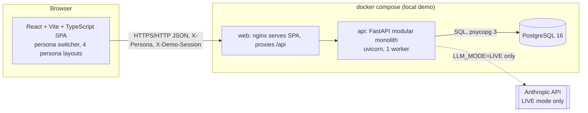
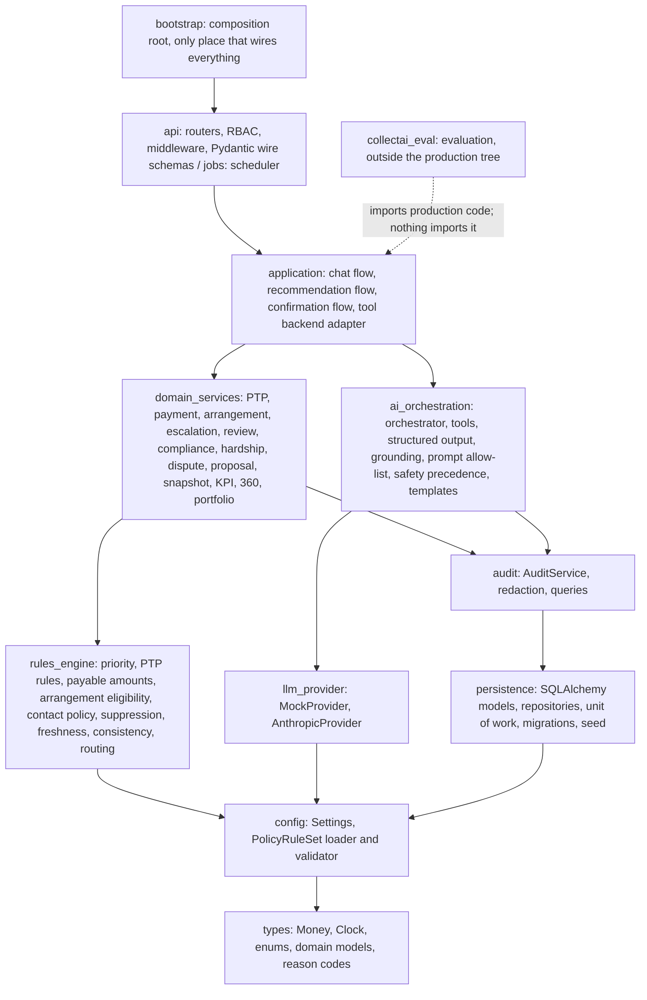
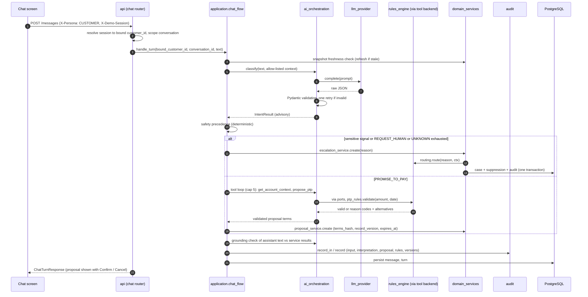
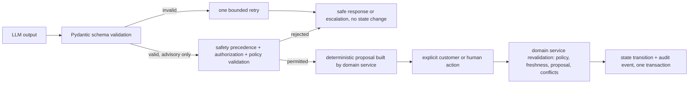

# CollectAI System Design

Status: design. Inputs: `docs/PRODUCT_VISION.md`, `docs/MVP_REQUIREMENTS.md`, `specs/brd/brd.md` (sections 10, 11, 13, 17), `specs/policy-ruleset-contract.md`, all stories in `specs/stories/`. Companion documents: `api-contracts.md` (endpoint and field source of truth), `data-models.md`, `folder-structure.md`, `component-map.md`, `deployment.md`.

CollectAI is a portfolio and learning project. It uses synthetic data only, simulates every payment, and has no real bank, payment-gateway or identity integration.

## 1. Architectural principles

1. **LLMs understand, classify, summarize, recommend and explain. Deterministic services calculate, validate eligibility, modify financial state and execute financial actions.** No financial figure, eligibility, priority score, band, routing destination or approval is ever produced by a model. This is enforced structurally (import boundaries, tool contracts, write path) and not only by prompting.
2. **Fail closed.** Invalid model output, provider failure, missing policy, stale data, inconsistent records and audit failure all produce a safe response or human escalation and never a state change (D-013).
3. **Human control of sensitive actions.** Settlement (deferred, escalate only), restructuring, exceptional arrangements, policy exceptions, vulnerable-customer cases, disputes, hardship relief and high-risk compliance always end in a human decision (BRD 5.7, D-026).
4. **One-way layering.** Modular monolith with an import direction that machine checks enforce (section 3). No microservices, no message bus (D-007).
5. **Everything material is auditable.** A state transition and its audit event commit or roll back together.
6. **Time and policy are injected.** `Clock` and the versioned `PolicyRuleSet` are dependencies, so behaviour is reproducible in tests (D-009, D-036).
7. **Simplicity.** One deployable API, one React app, one PostgreSQL database.

## 2. System context and topology



The only external system is the Anthropic API, reachable only from the `llm_provider` package and only when `LLM_MODE=LIVE`. MOCK mode (the default and the only mode used by tests and CI) makes zero network calls (E5-S1 AC1). There is no core banking, payment gateway, messaging channel or identity provider (BRD section 12).

Process model: one `api` process (uvicorn), synchronous request handlers (`def` endpoints run in FastAPI's thread pool), SQLAlchemy 2.0 sync sessions on psycopg 3, a synchronous Anthropic client. Rules-engine functions are pure and synchronous. An in-process scheduler (APScheduler) runs the PTP lifecycle job. Whole-message chat replies, no streaming (D-005).

## 3. Layered architecture



| Layer | Package (under `backend/src/collectai/`) | May import | Must never import |
|---|---|---|---|
| 0 | `types` | stdlib, pydantic | everything else |
| 1 | `config` | `types` | layers 2 and up |
| 2 | `persistence` | `types`, `config` | `audit` and up |
| 3 | `audit` | `types`, `config`, `persistence` | layers 4 and up |
| 4a | `rules_engine` | `types`, `config` | `persistence`, `llm_provider`, `ai_orchestration`, `anthropic`, network libraries |
| 4b | `llm_provider` | `types`, `config`, `anthropic` SDK | `rules_engine`, `domain_services`, `persistence` |
| 5a | `domain_services` | layers 0-4a | `ai_orchestration`, `llm_provider`, `anthropic` |
| 5b | `ai_orchestration` | `types`, `config`, `audit`, `llm_provider` | `rules_engine`, `domain_services`, `persistence`, `api` |
| 6 | `application` | layers 0-5 | `api` |
| 7 | `api`, `jobs` | layers 0-6 except `llm_provider` and `ai_orchestration` internals (only via `application`) | `bootstrap` |
| 8 | `bootstrap` | everything | none |
| n/a | `collectai_eval` (top-level, next to `collectai`) | any `collectai` package | imported by no production package |

How the rules work in practice:

- **The rules engine is deterministic and pure.** It takes typed inputs (an account snapshot, the active `PolicyRuleSet`, the injected `Clock` reading) and returns typed results with reason codes. It performs no I/O. Because it cannot import persistence, the AI layers or the network, it cannot be influenced by a model (E2-S1 AC5).
- **AI orchestration reaches deterministic capability only through ports.** `ai_orchestration/ports.py` declares protocols (`AccountContextPort`, `EligibleOptionsPort`, `ProposalPort`, `EscalationPort`, `AuditPort`) that return plain DTOs from `types`. `application/tool_backend.py` implements those ports by calling `domain_services` and `rules_engine`. Neither `ai_orchestration` nor `llm_provider` therefore imports any calculation, decision, approval or payment-recording code (E5-S4 AC10). The composition root injects the implementations.
- **Only `ai_orchestration` may use `llm_provider`, and only `llm_provider` may import the `anthropic` SDK** (E5-S1 AC4, D-015).
- **The manual officer PTP path has no dependency on AI** (`api/routers/ptps.py` to `domain_services/ptp_service.py`; E6-S6 AC3).
- **Evaluation depends on production code, never the reverse** (E10-S1 AC7). The KPI service reads `eval_run` rows through `persistence`, not through the evaluation package.
- **Enforcement:** `import-linter` contracts in `backend/.importlinter` (layers, forbidden imports, independent modules) run in CI, and `backend/tests/architecture/` contains story-specific tests (E2-S1 AC5, E5-S1 AC4, E5-S4 AC10, E10-S1 AC7, E6-S3 AC4 no payment-gateway import, E2-S1..S6 purity). Frontend: ESLint `no-restricted-imports` keeps `features/*` from importing each other.

## 4. Separation of concerns

| Concern | Where | Owns | Does not do |
|---|---|---|---|
| UI | `frontend/` | Rendering, persona switcher, accessibility, explicit Confirm/Cancel UX, labels distinguishing "AI-generated", "Rules engine" and "Simulated" | Business rules, authorization decisions, calculation (it displays server strings; money is never parsed to float) |
| API | `backend/.../api` | HTTP, validation of wire shapes, persona resolution, role-to-capability RBAC, object-level customer scoping, rate limits, idempotency-key handling, error envelope, correlation id | Domain logic |
| Application | `application` | Multi-step use-case orchestration (chat turn, NBA generation, confirmation) across AI and domain services | Calculations, direct SQL |
| Domain services | `domain_services` | State transitions (PTP, payment, arrangement, cases, disputes, hardship), revalidation on confirmation, transactional audit, idempotency | Model calls |
| Rules engine | `rules_engine` | All calculations and eligibility: priority, payable amounts, PTP validation and satisfaction, arrangement options and exception classification, contact frequency, suppression, freshness, consistency, routing | I/O, AI, persistence |
| AI orchestration | `ai_orchestration` | Prompt assembly from an allow-list, provider calls, schema validation, bounded retry, tool registry and cap, safety precedence, grounding check, templated fallbacks | Financial values, destinations, decisions |
| LLM provider | `llm_provider` | `LlmProvider` protocol, `MockProvider`, `AnthropicProvider`, timeouts, latency and token capture | Anything domain-specific |
| Persistence | `persistence` | Schema, migrations, repositories, unit of work, seed | Rules |
| Audit | `audit` | Append-only events, redaction, chain queries | Business decisions |
| Evaluation | `collectai_eval` | Labelled dataset, MOCK/LIVE runner, metrics, reporting rules | Being imported by production code |

## 5. Components

### 5.1 types (E1-S1)
`Money` (Decimal wrapper: rejects float, negative values and more than 2 dp with reason codes `NEGATIVE_AMOUNT`, `OVER_PRECISION`; serializes to a 2 dp string), `Clock` protocol with `SystemClock` and `SimulatedClock` (`set(now)`, `advance(days=n)`), the enums mirrored from the API contract (VULNERABLE_CUSTOMER is deliberately absent from `Intent`), Pydantic domain models, `ReasonCode` catalogue, `RuleResult[T]` (success or failure with reason code and policy version).

### 5.2 config (E1-S2)
`Settings` (pydantic-settings) validates the environment at startup with a named error per key (contract section 4). `PolicyRuleSet` loader: reads a version row from `policy_rule_set` (or the seed JSON at first boot), validates every parameter and every cross-field rule in the contract, computes `content_hash`, and refuses activation on any failure (startup fails, no partial application). Old versions load read-only by version id. If no valid active version exists at runtime, `get_active_policy()` raises `PolicyUnavailable`, which each rules service converts into a `POLICY_UNAVAILABLE` result: no eligibility, no options, no score, and (through routing) escalation with `AMBIGUOUS_VALIDATION`.

### 5.3 persistence (E1-S3)
SQLAlchemy 2.0 models, Alembic migrations, repositories, `UnitOfWork` (one transaction per request or job), seed generator, validator and prohibited-pattern scanner. Repositories for customer-owned aggregates expose only customer-scoped methods (mandatory `customer_id` argument) so the object-level authorization guarantee is structural. Details in `data-models.md`.

### 5.4 audit (E1-S4)
`AuditService.record_in(uow, event)` writes inside the caller's transaction; if the insert fails the transaction rolls back, so no state transition persists without its audit event. `AuditService.record(event)` is for non-state-changing AI activity and raises `AuditUnavailable` on failure so callers cannot report the activity as audited; it also writes an operational log line without customer data. `redaction.py` removes secrets and prohibited identifiers before insert (API-key patterns become `[REDACTED]`). The application DB role has INSERT and SELECT only on `audit_event` (grants plus a trigger).

### 5.5 rules_engine (E2-S1 to E2-S6)
Pure modules, each taking `(inputs, policy, now)` and returning `RuleResult`:

| Module | Function | Story |
|---|---|---|
| `priority.py` | score, band and ordered factors (Decimal, contributions sum exactly to score); `human_treatment` and `automated_treatment_suppressed` flags | E2-S1 |
| `ptp_rules.py`, `payable.py` | amount and date validation with reason codes and computed alternatives; payable amounts; PTP satisfaction (cumulative qualifying simulated payments) | E2-S2 |
| `arrangement.py` | eligible options with exact-sum schedules (last installment absorbs the remainder), ELIGIBLE/EXCEPTIONAL/NOT_ELIGIBLE classification, exception authority check | E2-S3 |
| `contact_policy.py`, `suppression.py` | MAX_ATTEMPTS, MIN_INTERVAL, item and account scope suppression | E2-S4 |
| `freshness.py`, `consistency.py` | FRESH, STALE, UNKNOWN; INCONSISTENT_RECORD checks (bucket vs dpd, negative balance, overdue above balance) | E2-S5 |
| `routing.py` | reason to queue, reviewer role and priority; fallback for unknown reasons; never accepts a queue or role argument | E2-S6 |

Every function records the policy version in its result. Inconsistent or unfresh records yield a failure result and never an eligibility, option or score.

### 5.6 llm_provider (E5-S1)
`LlmProvider.complete(request) -> ProviderResult` with model id, latency, token usage, raw text. `AnthropicProvider` (LIVE) reads `ANTHROPIC_MODEL` and `ANTHROPIC_API_KEY` from settings; `MockProvider` is scriptable per test (valid, malformed, adversarial, timeout) and deterministic by default (keyword-based classifier used for demos and CI). Timeouts raise `ProviderTimeout`. The factory picks the implementation from `LLM_MODE`.

### 5.7 ai_orchestration (E5-S2 to E5-S4, E4-S3, E6-S1)
- **Prompt builder:** assembles prompts from allow-listed context fields only (E5-S3 AC4). Forbidden fields (for example `national_id`) are dropped structurally because the context is a frozen Pydantic model with an explicit field list.
- **Structured output:** Pydantic schemas for `IntentResult` (label, confidence, rationale, `vulnerability_detected`, optional `vulnerability_category`, `vulnerability_rationale`, `special_request`), `NextBestAction` (action enum, rationale, referenced factor ids) and tool arguments. One bounded retry (`AI_RETRY_BOUND`) on schema-invalid output or timeout, then a safe response.
- **Safety precedence:** deterministic code, not the model, applies D-016: if the interpretation carries DISPUTE, FINANCIAL_HARDSHIP, REQUEST_HUMAN, `vulnerability_detected` or `special_request != NONE`, transactional processing pauses and only escalation-related tools run.
- **Tool registry:** exactly six tools (READ `get_account_context`, `get_eligible_options`; PROPOSE `propose_ptp`, `flag_hardship`, `flag_dispute`, `escalate_to_human`). Each has a Pydantic argument schema. Unknown names and invalid arguments return a tool error and never execute. `escalate_to_human` accepts only an `EscalationReason` and a rationale. PROPOSE calls are idempotent (derived key) and capped per turn by `TOOL_CALL_CAP_PER_TURN` (default 5); a request past the cap does not execute, writes `TOOL_CAP_REACHED`, and the turn ends with a safe reply or an `AI_FAILURE_FALLBACK` escalation.
- **Grounding check:** extracts currency figures, dates and option identifiers from assistant text and blocks the message if any is absent from the service results in context; the message is replaced by a template built from the service output and a grounding-violation event is counted (E5-S3).
- **Templates:** all customer-facing text that carries money, dates or options is produced from service output by templates. Model text is used for tone and explanation only and is grounded-checked.

### 5.8 domain_services (E6, E7, E8, E4, E10-S3, E9-S3)
Each mutating service follows the same skeleton: authorization already resolved by the API; **revalidate** (policy available, snapshot fresh, proposal valid, no conflicting active item, not a disputed item); **transition** via repository with optimistic version; **audit** in the same transaction; **idempotency record** in the same transaction. Key services: `ptp_service` (used by officer manual path and by confirmation), `payment_service` (simulated only, no HTTP client anywhere in the module), `arrangement_service`, `escalation_service` (calls `rules_engine.routing`, sets suppression, idempotent per conversation and reason), `review_service` (reviewer actions and state machine), `compliance_service` (the single COMPLIANCE_RISK capability, touches only case, decision, suppression release, audit), `hardship_service`, `dispute_service`, `proposal_service` (creates and confirms proposals), `snapshot_service` (simulated core sync), `ptp_lifecycle` (KEPT/BROKEN, safe to rerun), `customer360_service`, `portfolio_service`, `kpi_service`, `demo_controls_service`.

### 5.9 application (E4-S3, E6-S1 to E6-S3, E7-S1, E8)
`chat_flow` runs the turn: refresh-if-stale, classify, safety precedence, bounded tool loop, grounding, persist, audit. `confirmation_flow` handles the explicit confirm and cancel actions (not an LLM decision, D-041). `recommendation_flow` builds the NBA. `tool_backend` adapts ports to services.

### 5.10 api (E3-S1, E3-S5, all endpoint stories)
FastAPI app with routers per resource group (`system`, `session`, `portfolio`, `customer360`, `recommendations`, `ptps`, `me`, `chat`, `escalations`, `hardship`, `disputes`, `audit`, `kpis`, `demo_controls`). Middleware order: correlation id, error envelope, persona resolution, demo-controls gate (404 before persona checks when disabled), rate limit. Each route declares one capability (`x-capability`); the generated role x endpoint test walks every registered route for all four personas. `contract test` compares FastAPI's generated OpenAPI with `api-contracts.schema.json` (`tests/api/test_openapi_contract.py`).

### 5.11 frontend (E3-S3, E3-S4, E4-S2, E6-S5, E7-S3, E7-S6, E9-S2, E9-S3, E10-S4)
React, Vite, TypeScript, React Router, TanStack Query, Tailwind CSS, and shadcn/ui (Radix primitives, chosen for accessible dialogs, focus trapping and keyboard support; resolves BRD open question 18.1 item 2). API types are generated from `api-contracts.schema.json` (`openapi-typescript`). Route guards mirror the server capabilities from `GET /api/session/me`, but the server is authoritative: a forbidden route renders a forbidden page and no data. Layouts: `CustomerLayout` (chat only) and `InternalLayout` (officer, manager, compliance), logically separate so they can be split later (D-012). The demo label "Demo persona - not real authentication" and the current persona are always rendered.

### 5.12 collectai_eval (E10-S1, E10-S2)
Versioned dataset (`datasets/eval-ds-v1.json`: version, provenance, at least 50 labelled synthetic cases, no upper bound), a runner (MOCK by default; LIVE requires an explicit flag and an API key and refuses to run in CI), metrics (intent accuracy, per-category TP/FN/recall, escalation precision, recall and over-escalation, structured-output compliance, grounding, separate vulnerable-customer safety set) and a report generator that applies the 30-case rule per category and keeps MOCK and LIVE in separate sections. Runs are stored as `eval_run` rows.

## 6. Key data flows

### 6.1 Customer chat turn producing a Promise-to-Pay proposal (Journey A)



Nothing has changed financial state at this point. The PTP is created only when the customer clicks Confirm.

### 6.2 Explicit confirmation (D-041)

```mermaid
sequenceDiagram
    participant UI
    participant API
    participant CF as confirmation_flow
    participant DS as ptp_service / payment_service / arrangement_service
    participant RE as rules_engine
    participant DB
    UI->>API: POST /proposals/{id}/confirm (Idempotency-Key, terms_hash)
    API->>CF: confirm(bound_customer, proposal_id, key, terms_hash)
    CF->>DB: idempotency lookup (replay returns original, 200)
    CF->>DS: create_from_proposal(...)
    DS->>RE: revalidate: policy available, freshness, terms_hash, record_version, expiry, conflicts, disputed item
    alt any check fails
        DS-->>API: PROPOSAL_INVALID / CONFLICTING_ACTIVE_ITEM / DISPUTED_ITEM / AMBIGUOUS_VALIDATION (no state change)
    else all pass
        DS->>DB: BEGIN; insert PTP / PaymentEvent(simulated=true) / arrangement; audit; idempotency; COMMIT
        DS-->>API: 201 ConfirmResult
    end
```

If the audit insert fails, the transaction rolls back and the API returns `503 AUDIT_UNAVAILABLE` with no record created.

### 6.3 Next-best-action (US-003)
Officer opens Customer 360, which is read-only and never triggers AI (`GET /api/customers/{id}/360` returns the stored recommendation under `ai`). Generation is an explicit `POST .../recommendation`: `recommendation_flow` loads the deterministic block (priority, factors, treatment, freshness), calls the model for a structured `NextBestAction`, validates the schema (one retry, then `SAFE_FALLBACK`), rejects a rationale that cites a factor, amount or option not returned by the deterministic services (templated text, `content_source=TEMPLATE`), and forces `ESCALATE_TO_HUMAN_REVIEW` (`HUMAN_REVIEW_ONLY`) for accounts under dispute, hardship, vulnerable flag or open escalation regardless of model output. The recommendation and its audit event are stored in one transaction; on audit failure the endpoint returns `503 AUDIT_UNAVAILABLE` with no body. The officer may ACCEPT or OVERRIDE (reason mandatory) via the decision endpoint, which feeds the human override rate.

### 6.4 Sensitive intents and escalation (E7-S1, E8-S2, E8-S3)
Sensitive signals (hardship, dispute, request for a human, vulnerability, settlement or policy-exception requests, exhausted clarifications, `PAYMENT_PLAN` before Slice 2) never reach a transactional tool. `escalation_service.create` calls `rules_engine.routing` (reason in, queue, reviewer role, priority and policy version out), inserts the `escalation_case`, sets suppression per policy, and writes the audit event in one transaction; the customer receives a respectful templated message that promises follow-up and contains no plan, relief, settlement, approval or opinion on dispute validity. Creation is idempotent per key and per (conversation, reason) while a case is open. If the write fails, the customer is told the handoff was not completed and automated treatment stays paused (`HANDOFF_FAILED`).

### 6.5 Officer manual PTP (E6-S6)
`POST /api/ptps` (COLLECTIONS_OFFICER) goes `api` to `ptp_service` directly. It uses the same validator, freshness check, policy, idempotency, audit and transitions as the chat path, works when the provider is down, and is rejected for disputed items (`DISPUTED_ITEM`) and conflicting active PTPs (`CONFLICTING_ACTIVE_ITEM`). It is not a guardrail bypass (D-040).

### 6.6 Reviewer decision and compliance decision (Slice 2)
`POST /api/escalations/{id}/decisions` (officer) and `.../compliance-decision` (COMPLIANCE_RISK) run in one transaction: role and reviewer_role check, `expected_version` optimistic check, state machine, policy permission (APPROVE availability computed from `exception.authority.*`), mandatory reason or note, then effect (for an approved exceptional arrangement: revalidate authority and freshness, create the arrangement through `arrangement_service` with exactly the requested terms), decision row, audit event, idempotency record. ESCALATE takes only a whitelisted reason; `routing` picks the destination and a new linked case is created. The compliance capability touches only the case, its decision, suppression release and audit; a before/after table comparison test proves no financial or collections state changes.

### 6.7 PTP lifecycle (E6-S4)
`ptp_lifecycle.run(now)` (scheduler, and demo control) loads PENDING PTPs, sums qualifying successful simulated payments by the due date (`ptp_rules.evaluate_satisfaction`), and transitions KEPT (also evaluated synchronously when a payment is recorded), stays PENDING with `cumulative_paid` recorded, or transitions BROKEN once `promised_date < today` unsatisfied. Each transition is guarded by status, so reruns and replayed payments never re-transition or duplicate audit events.

### 6.8 Audit read (E9-S1, E9-S2)
COMPLIANCE_RISK queries `/api/audit` and `/api/audit/chains`; events are ordered by (timestamp, sequence) and grouped by `correlation_id` into the six stages. There is no write route. Responses contain only redacted values.

### 6.9 Evaluation (E10)
`python -m collectai_eval run --mode MOCK|LIVE` loads the dataset, drives `application.chat_flow` classification against the chosen provider, scores, writes `eval_run` and `eval_case_result` rows and a report. The KPI API reads the stored runs.

## 7. AI safety architecture



| Guardrail | Mechanism | Stories |
|---|---|---|
| Model cannot change money, balances, eligibility, approvals | No mutation tool exists; ports expose only READ and PROPOSE; import-linter and architecture tests | E5-S4, E2-S1 |
| Model output is advisory | Pydantic schemas; deterministic precedence; deterministic services own decisions | E5-S2, E6-S1 |
| Ungrounded figures or options never reach the customer | Grounding check plus templates | E5-S3 |
| Model cannot choose a queue, role or priority | `escalate_to_human(reason, rationale)` only; routing service decides | E5-S4, E2-S6 |
| Hostile or malformed provider output | Hostile-provider test (50 adversarial outputs, zero state changes); red-team suite | E5-S2, E9-S4 |
| Prompt leakage and PII | Allow-listed prompt context, redaction, prompt and log scans | E5-S3, E9-S4 |
| Runaway loops | Per-turn tool cap, chat rate limit, bounded retry, clarification limit | E5-S4, E6-S1 |
| Provider down | Templated safe reply, "Talk to a human" always available, manual workflows | E5-S2, E6-S5, E4-S2 |
| MOCK never mistaken for quality evidence | `mode` recorded on every EvalRun, separate report sections, KPI labels | E10-S2, E10-S3 |

Talk to a human (`POST .../handoff`) never depends on the AI provider and is never discouraged.

## 8. Human-in-the-loop map

| Sensitive action or scenario | What the system does automatically | Who decides | Enforcement |
|---|---|---|---|
| Settlement request | Detect via `special_request=SETTLEMENT`, escalate `SETTLEMENT_REQUEST`, suppress automation | Collections Officer (no settlement workflow exists; deferred, D-023) | Routing table; no settlement code or table |
| Exceptional payment arrangement | Classify EXCEPTIONAL deterministically, escalate `EXCEPTIONAL_ARRANGEMENT`, never offer or promise it | Officer within `exception.authority`; otherwise reject, request info or escalate | `arrangement` rules, `review_service`, APPROVE availability |
| Financial hardship (restructuring or relief) | Record structured indicators, suppress account treatment, escalate with elevated priority | Officer; no relief executed in MVP | `hardship_service`, suppression |
| Vulnerable-customer signal | Set flag, escalate `VULNERABLE_CUSTOMER` (elevated or urgent), suppress account treatment | Officer; flag released only by human decision | Routing, suppression |
| Dispute | Capture category and reason, pause the disputed item, escalate `DISPUTE`; model never judges validity | Officer resolves with outcome and reason | `dispute_service` |
| Policy exception, high-risk compliance | Escalate to `COMPLIANCE_REVIEW` | COMPLIANCE_RISK via the single `record_compliance_review_decision` capability | RBAC plus `compliance_service` |
| Ambiguous validation (stale, unknown freshness, policy unavailable, PAYMENT_PLAN in Slice 1) | Refuse action, escalate `AMBIGUOUS_VALIDATION` | Officer | Freshness and policy fail-closed |
| PTP, PAYMENT, ARRANGEMENT creation | Prepare a deterministic proposal | The customer's explicit Confirm click (application action, not a tool call) | `confirmation_flow`, `terms_hash` |

## 9. Transactions, concurrency, idempotency and freshness

- **One transaction per state change:** repository writes, audit event and idempotency record commit together (`UnitOfWork`). Audit failure rolls the transaction back (E1-S4 AC3).
- **Optimistic concurrency:** `version` on cases, disputes, PTPs, arrangements, hardship; `record_version` on delinquency records. Reviewer and dispute actions send `expected_version`; mismatch yields `409 VERSION_CONFLICT` with no change, so two officers cannot both decide.
- **Idempotency:** `Idempotency-Key` on consequential operations, stored in `idempotency_record`; PROPOSE tool keys are derived deterministically; partial unique indexes give natural-key protection (one PENDING PTP and one ACTIVE arrangement per account, one open hardship case or dispute, one open case per conversation and reason).
- **Freshness:** consequential transitions re-check `as_of` and `record_version` against the current row and `freshness.max_snapshot_age_minutes`. Stale gives `STALE_DATA` (reported as `PROPOSAL_INVALID` in confirm flows) and returns refreshed context; unknown freshness fails closed and reports `AMBIGUOUS_VALIDATION`. The simulated core sync (`POST /api/customers/{id}/refresh`, and the Clock advance control) updates `as_of`, rolls DPD forward and bumps `record_version`, invalidating pending proposals.
- **Time:** every timestamp and every age or date comparison uses the injected `Clock`. `SimulatedClock` persists to `clock_state` so all requests see the same simulated time.

## 10. Security and data safety

- **Persona RBAC (D-019):** the `X-Persona` header selects one of four personas; the static role-to-capability matrix (`api-contracts.md` 1.7) is enforced on every route, and every 403 is audited. COLLECTIONS_MANAGER gets 403 on every mutating call; COMPLIANCE_RISK on every mutating call except `POST /api/escalations/{id}/compliance-decision`. This is a demonstration mechanism and is labelled "not real authentication" in the UI and API.
- **Customer binding (D-032):** `POST /api/session` binds a CUSTOMER session token (only its hash is stored) to one seeded `customer_id`. The client never sends a customer id; CUSTOMER schemas reject it. Customer-facing repositories require the bound id, so a cross-customer id returns the same 404 as a missing resource, and the denial is audited without the target's contents.
- **Synthetic data only:** seed and scan tooling reject real-looking PII (emails only on `example.com`, phones only `+1-555-01xx`, no 13 to 19 digit numbers, CVV, PIN or government identifiers). No card numbers, credentials or government identifiers exist in the schema.
- **Secrets:** `ANTHROPIC_API_KEY` only from the environment or a git-ignored `.env`; never logged or audited (redaction, log scan in CI). `.env.example` has placeholders only.
- **Input handling:** customer text is length-limited (2000 chars), treated as data (never concatenated into instructions without delimiters), and stored redacted in logs; prompt-injection and policy-override cases are part of the red-team suite.
- **Error handling:** the error envelope never contains stack traces, secrets or another customer's data.
- **CORS and network:** the SPA and API share an origin through the nginx proxy; no CORS wildcards.

## 11. Observability and performance

- **Correlation id** on every request (`X-Correlation-Id`), propagated to audit events, structured JSON logs (structlog) and provider calls.
- **Captured per AI interaction:** provider latency, tool-call duration, end-to-end duration, token usage and estimated cost where available, model id, prompt version, policy version.
- **Targets (observational, local demo):** Portfolio and Customer 360 interactive under 2 s p95 on the 1,000-account dataset (30 scripted Playwright loads after one warm-up). Design support: partial indexes on `delinquency_record`, priority computed in a single pass over at most 1,000 rows, pagination default 50. LIVE chat p95 under 8 s is reported, not guaranteed.
- **Health:** `/api/health` (liveness) and `/api/ready` (database, migrations, active valid PolicyRuleSet, audit role grants).

## 12. Key design decisions

| ID | Decision | Rationale | Alternatives rejected | Traces to |
|---|---|---|---|---|
| DD-01 | Modular monolith with import-linter-enforced one-way layers | Demonstrates architecture discipline without distributed-system cost | Microservices, message bus | D-003, D-007 |
| DD-02 | Rules engine is pure functions over typed inputs, no I/O | Reproducible, unit-testable, cannot be reached by a model | Rules embedded in domain services | D-022, E2-S1 |
| DD-03 | AI reaches deterministic capability only through ports implemented in `application` | Removes any import path from LLM code to decision or mutation code | Direct calls from orchestrator to services | D-011, E5-S4 AC10 |
| DD-04 | Confirmation is an API action referencing a proposal (`terms_hash`, `record_version`, expiry), revalidated at confirm | Consent and state change stay deterministic; stale or altered terms fail | Treat a model tool call as consent | D-041 |
| DD-05 | Text plus CHECK for enums; NUMERIC(14,2) for money; string money on the wire | Cheap enum evolution; exactness; no float anywhere | Native enums; float or integer cents | D-003, E1-S1 |
| DD-06 | Immutable versioned PolicyRuleSet rows in PostgreSQL with content hash; seed values in `policy-v1` | Audit can always resolve the exact rules; fail-closed activation | Config file edited in place; DB rows mutable | D-036 |
| DD-07 | Priority and suppression are computed, not stored | No staleness; reproducible per policy version | Materialized scores | D-022 |
| DD-08 | Audit in the same transaction; grant-level append-only; no FKs from audit to business tables | Atomic with the transition; survives reseed; tamper resistance | Async audit queue; audit via logs | E1-S4, BRD 10.5 |
| DD-09 | Idempotency by stored key plus natural-key partial unique indexes | Duplicate submissions cannot create duplicate state, even under concurrency | Client-side prevention | D-037 |
| DD-10 | Optimistic concurrency with `expected_version` | Two officers cannot both decide; no long locks | Pessimistic locking | E7-S2 |
| DD-11 | Persona header plus server-issued demo session token for CUSTOMER | Demonstrates authorization and object-level checks without IAM scope | Real auth; client-only toggle | D-019, D-032 |
| DD-12 | Synchronous stack (FastAPI `def`, SQLAlchemy sync, sync Anthropic client), whole-message replies | Simplest correct model for a single-instance demo; easier audit and testing | Async everywhere; SSE streaming | D-005 |
| DD-13 | Clock injection with `SimulatedClock` persisted in `clock_state` | Deterministic PTP lifecycle and demos; one clock for all requests | Patching time in tests only | D-009 |
| DD-14 | Evaluation package outside the production tree; results in `eval_run` | Production cannot depend on it; MOCK and LIVE separated by data | Evaluation inside the app | D-002, E10-S1 |
| DD-15 | Single ports-based `MockProvider` used in dev, CI and evaluation regression | No network in tests; hostile-output testing | Recorded HTTP fixtures | E5-S1 |
| DD-16 | API contract is source of truth; OpenAPI checked against FastAPI in CI; TS types generated | No drift between UI and API | Hand-written client types | api-contracts.md |
| DD-17 | shadcn/ui (Radix) with Tailwind | Accessible dialog, focus and keyboard primitives; neutral banking look | Custom components; heavy design system | D-012, D-029 |
| DD-18 | Officer manual PTP path independent of AI | Permitted work stays available when the provider is down | AI-only recording | D-040 |
| DD-19 | Derived treatment suppression; released only by human decision | A single query answers "is automation allowed"; nothing time-based or AI-driven clears it | Boolean flags on the account | E2-S4, E7-S1 |
| DD-20 | Seed ids deterministic, generated ids ULID | Reseed keeps audit references resolvable; sortable ids | UUIDv4 everywhere | E9-S3 |

## 13. Failure handling summary

| Failure | Behaviour | HTTP or state |
|---|---|---|
| Provider timeout or error after retry | Templated safe reply, human handoff offered, `AI_FAILURE_FALLBACK` case | 200 `safe_state=AI_UNAVAILABLE` |
| Schema-invalid model output after retry | Safe response, invalid output stored in the audit event, no state change | 200 safe reply / `SAFE_FALLBACK` |
| Output conflicts with a rule result | Rule result prevails, `POLICY_CONFLICT_REJECTED` audit event | 200 |
| Tool cap reached | Further calls not executed, `TOOL_CAP_REACHED`, safe reply or fallback escalation | 200 `safe_state=TOOL_CAP_REACHED` |
| No valid active PolicyRuleSet | Rules services return `POLICY_UNAVAILABLE` (no score, options or eligibility); routing falls back to COLLECTIONS_REVIEW; Customer 360 still loads without priority | 503 on rule-dependent writes; 200 with status on read models |
| Stale or unknown snapshot | Consequential action refused, refreshed context returned; unknown escalates `AMBIGUOUS_VALIDATION` | 409 `STALE_DATA` / `AMBIGUOUS_VALIDATION` |
| Inconsistent record | Excluded from portfolio scoring, action refused `INCONSISTENT_RECORD`, flagged | excluded / 409 |
| Audit write fails (state change) | Transaction rolled back, nothing persists | 503 `AUDIT_UNAVAILABLE` |
| Audit write fails (material AI response) | Safe unavailable state, no proposal or recommendation body | 200 `safe_state=AUDIT_UNAVAILABLE` / 503 |
| Escalation write fails | Customer told handoff not completed; treatment stays paused | 503 `HANDOFF_FAILED` |
| Database down | Infrastructure fault | 503 `SERVICE_UNAVAILABLE` |
| Duplicate submission | Original result returned | 200 `Idempotent-Replayed: true` |
| Concurrent reviewer decisions | Loser rejected, case unchanged | 409 `VERSION_CONFLICT` |

## 14. Slice alignment

| Slice | Backend | Frontend | Notes |
|---|---|---|---|
| 1 | types, config, persistence, audit, rules (priority, PTP, contact, freshness, routing), provider, orchestration, portfolio, 360, NBA, chat, PTP, simulated payment, lifecycle, minimal escalations, audit API, demo controls, eval framework | Persona switcher, Portfolio, Customer 360, Chat, minimal escalation list, Audit viewer, demo controls | Journey A end to end; PAYMENT_PLAN maps to `AMBIGUOUS_VALIDATION` escalation |
| 2 | arrangement rules and flow, review queue API, exception handling, compliance decision, hardship | Full review queue, case detail | Journeys B1 and B2 |
| 3 | dispute identification, review and resolution | (reuses queue) | Journey C |
| 4 | KPI API, portfolio deliverables | Dashboard | Built last (D-017) |

## 15. Future considerations (not built)

Streaming chat (SSE), message bus and event-driven services, multi-model routing, shared rate-limit store for multiple API instances, real identity provider, deployment to a managed platform. These are recorded to make the extension points visible: the ports layer and the provider abstraction are where they would attach.
